# LAMP GISSMO

LAMP GISSMO는 ls-dyna에서 재료의 파단을 재현하기 위해 사용되는 GISSMO(Generalized Incremental Stress State dependent damage MOdel) 물성을 생성할 수 있는 인터페이스를 제공합니다. LAMP GISSMO를 이용하기 위해서는 다음과 같은 항목들이 필요합니다.

- LS-Dyna License and Solver
- LS-OPT ([LS-Dyna 최적화 도구](http://www.kostech.co.kr/ls-opt))
- 최소 3개 이상의 재료 시편 모델 (ex. Uniaxial, Shear, Norch, Biaxial 등등)
- 각 재료 시편 모델의 Force-Displacement 시험 Curve 데이터

LAMP GISSMO는 총 5단계로 구성되며 각 단계에서 수행되는 내용은 다음과 같습니다.

Step 1
: 준비된 시편 모델들을 불러오고 LS-OPT를 이용하여 최적화할 파라미터들의 정보를 입력

Step 2
: Step1 에서 입력한 시편 모델 및 변수 정보를 바탕으로 LS-OPT 최적화 시뮬레이션을 수행

Step 3
: Step2 에서 수행한 최적화 시뮬레이션 결과에서 최적의 결과를 선택하고 Fracture 및 Instability Curve를 생성

Step 4
: Step4에서는 모델의 메쉬 크기에 따른 결과 차이를 보정하기 위해 메쉬 정규화를 진행합니다. 메쉬 정규화를 위해 하나의 Reference 시편 모델이 선택되며, Reference 모델과 형상을 동일하면서 다른 메쉬 크기를 가지는 시편 모델이 요구됩니다. 

Step 5
: Step1~4까지 진행된 내용을 체크하고 LS-Dyna에서 사용 가능한 GISSMO 파단 물성 카드를 생성합니다.

## GISSMO Interface Panel

LAMP GISSMO의 입력 패널의 제일 상단에는 작업 디렉토리(Working Directory)를 설정하는 항목이 있습니다. 작업 디렉토리에는 과정중에 생기는 파일들이 저장되는 경로이며, 특정 경로에서 불러오는 시편모델등의 데이터는 따로 복사되어 저장되지 않습니다.

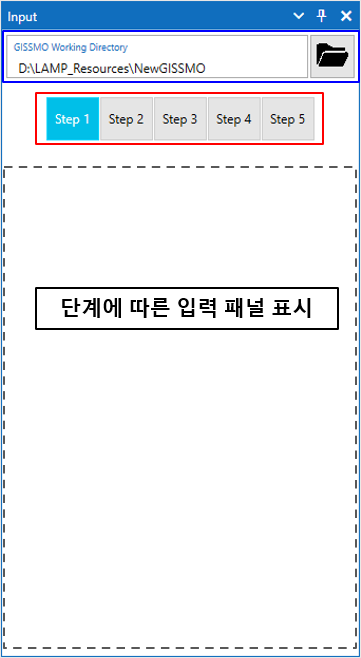

## Step 1

Step 1에서는 준비된 시편 모델들을 추가하고 설계 파라미터들의 범위를 입력합니다. \
추가된 모든 시편 모델에 대해 다음의 항목들을 선택 및 입력합니다.

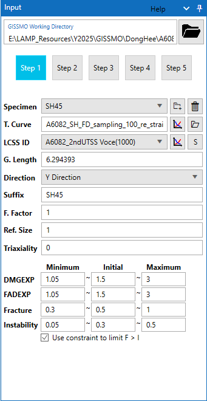

- Specimen : 우측 {w=25px}  아이콘 버튼을 클릭하고 시편 모델의 메인 키워드(Keyword) 파일 및 LAMP GISSMO에서 생성된 *.lsopt 파일을 선택합니다. 시편 모델을 정상적으로 읽었다면 다음의 과정들이 진행됩니다. 

    - Keyword 파일에서 *DEFINE_CURVE 카드를 찾고 Curve의 ID를 LCSS ID 항목에 추가합니다.
    - Keyword 파일에서 *DATABASE_HISTORY_NODE_ID 카드를 찾고 입력된 두 개의 노드 정보로 부터 Gauge length를 계산해 G. Length 항목에 입력합니다. 

    :::{caution}
    시편 모델에는 해석 과정중에 변위가 계산될 수 있도록 *DATABASE_HISTORY_NODE_ID 카드를 이용해 변위 계산을 위한 두 개의 노드 ID를 설정해야 합니다.
    :::

    :::{tip}
    *.lsopt 파일을 이용한 시편 모델 등록은 *.lsopt 파일에 정의된 target curve와 LCSS ID 정보 그리고 4개의 파라미터(DMGEXP, FADEXP, Fracture, Instability) 정보가 추가적으로 입력됩니다.
    :::

- T. Curve : 우측 폴더 모양의 아이콘을 클릭하고 추가한 시편 모델의 Force-Displacement 시험 데이터가 정의된 파일을 선택합니다. 좌측 그래프 모양 아이콘으로 선택한 데이터를 그래프로 확인 할 수 있습니다.

- LCSS ID : 시편 모델을 불러오면서 인식된 *DEFINE_CURVE들의 ID 항목이 추가되며, *MAT_PIECEWISE_LINEAR_PLASTICITY 카드에 사용될 Curve의 ID를 선택합니다.

- G. Length :  *DATABASE_HISTORY_NODE_ID 카드에 정의된 두 노드 정보로 부터 계산된 Gauge length를 표시합니다.

- Direction : 시편이 인장되는 방향을 설정합니다.

- F. Factor : Force Factor를 입력하는 항목으로 Biaxial 시편 모델에만 입력된 값이 사용됩니다.

- Ref. Size : 시편 모델에서 변위를 계산하는 요소의 사이즈를 입력합니다.

- DMGEXP(Exponent for nonlinear damage accumulation) : GISSMO 재료 모델의 DMGEXP 파라미터의 설계 범위를 입력합니다.

- FADEXP(Exponent for damage-related stress fadeout) : GISSMO 재료 모델의 FADEXP 파라미터의 설계 범위를 입력합니다.

- Fracture : 해당 시편의 파단에 대한 equivalent plastic strain을 결정하기 위한 파라미터의 설계 범위를 입력합니다.

- Instability : 해당 시편의 Critical equivalent plastic strain을 결정하기 위한 파라미터의 설계 범위를 입력합니다.

:::{tip}
Specimen 항목의 ComboBox에 추가된 시편 모델들을 변경할 수 있습니다. 변경 시 선택된 시편 모델의 입력 정보로 변경됩니다. \
Specimen 항목의 우측 휴지통 아이콘을 통해 추가된 시편 모델을 제거 할 수 있습니다.
:::

## Step 2

Step 2에서는 Step 1에서 입력된 시편 모델과 파라미터 정보를 기반으로 LS-OPT를 사용하여 최적화 시뮬레이션을 수행합니다. \
최적화 시뮬레이션은 LS-OPT 뿐만 아니라 LS-Dyan Solver를 사용하기 때문에 각각의 정보를 입력합니다. 


### Solver option
LS-Dyna Solver에 대한 정보를 입력합니다. smp, mpp Solver 둘 다 사용가능하며 mpp solver의 경우 MPI 경로가 필요합니다.

- On server : Linux 계열의 클러스터 장비에서 최적화 시뮬레이션을 하고자 할 경우에 선택합니다.
- On client : Windows 운영체제의 사용자 PC 즉 local PC에서 최적화 시뮬레이션을 하고자 할 경우에 선택합니다.
- MPI Path : mpp solver를 사용하는 경우에 우측 ... 아이콘을 통해 MPI 경로를 선택합니다.
- Solver : LS-Dyna solver를 선택합니다. 우측 ... 아이콘을 통해 solver가 위치한 디렉토리를 선택하면 디렉토리내의 모든 solver가 추가됩니다. 
- LSOPT : LS-OPT 실행 파일이 존재하는 디렉토리를 우측 ... 아이콘을 통해 선택합니다.
- Memory1 & Memory2 : LS-Dyna solver의 메모리 옵션 값을 입력합니다. 
- NCPU : LS-Dyna solver에 사용할 계산 CPU 코어의 수를 입력합니다. 

### LSOPT Option
LS-OPT 최적화 시뮬레이션 옵션 값을 입력합니다.

- Num. of Simulation Points : 각각의 Iteration에서 수행할 시뮬레이션 횟수를 입력합니다.
- Execution Global Limit : 각 Iteration의 시뮬레이션 횟수에서 동시에 실행할 시뮬레이션의 수를 제한하기 위한 값을 입력합니다.
    :::{tip}
    각 Iteration에서 LS-Dyna 시뮬레이션은 Num. of Simulation Points의 값에 대해서 동시에 실행됩니다. 따라서 Solver option에서 NCPU의 값이 4이고 Num. of Simulation Points의 값이 8이라면 한번의 Iteration에 총 32개의 CPU 코어가 사용됩니다. 하지만 가용 가능한 CPU 코어의 수가 16개라면 동시에 실행되는 시뮬레이션의 수를 제한해야 합니다. 따라서 Execution Global Limit 값을 4로 주어 하나의 Iteration에서 8개의 시뮬레이션을 동시에 실행하지 않고 4개씩 끊어서 순차적으로 실행되도록 하여 가용 가능한 16개의 코어를 사용하도록 합니다.
    :::

### Status
Step 2에서의 진행 상태를 표시합니다. 우측의 사각형 마크는 빨강, 주황, 초록색으로 상태가 변경됩니다. \
좌측의 체크박스는 시편 모델의 최적화 시뮬레이션 수행 유무를 구분하는 항목으로 최적화 시뮬레이션 실행 시 체크된 시편 모델에 대해서만 최적화 시뮬레이션이 진행됩니다.

- <span style="color:red">빨강</span> : 빨강색으로 해당 시편 모델의 최적화 시뮬레이션이 수행되지 않은 상태를 의미합니다.
- <span style="color:orange">주황</span> : 주황색은 해당 시편 모델의 최적화 시뮬레이션이 수행중인 상태를 의미합니다.
- <span style="color:green">초록</span> : 초록색은 해당 시편 모델의 최적화 시뮬레이션이 성공적으로 종료되었음을 의미합니다. 

### LSOPT Project Generation
Step1에서 추가된 시편 모델들의 GISSMO 파라미터들의 최적화 시뮬레이션을 수행하는데 있어 각 시편을 개별적으로 시뮬레이션을 수행 하거나(Individual) 모든 시편을 통합하여 시뮬레이션(Integration) 할 수 있습니다. 통합 해석(Integration)의 경우에는 Base specimen 모델을 선택해야 합니다. Base specimen을 선택함으로써 GISSMO 파라미터인 DMGEXP와 FADEXP는 Base specimen의 입력값으로 변경되어 시뮬레이션이 수행됩니다. 

:::{tip}
Base specimen의 선택에 제한은 없지만 일반적으로 인장 모델(Uniaxial Tension)을 사용합니다.
:::

:::{attention}
통합 해석은 LSOPT 7.0 버전에서 테스트 되었습니다. LSOPT 7.0 이하 버전에서는 동작되지 않을 수 있습니다.
:::

### Card type
LS-Dyna에서 지원되는 GISSMO 재료 카드는 2가지가 있습니다. MAT_ADD_DAMAGE_GISSMO 카드는 LS-Dyan R12 버전을 포함한 상위 버전에서 지원되는 카드입니다. R12 버전 이상의 LS-Dyna solver를 사용하는 경우에는 MAT_ADD_DAMAGE_GISSMO 카드 사용을 권장 드립니다.

### Scheduler
Solver option에서 On server를 선택하였다면 스케쥴러 기능을 활용할 수 있습니다. 현재 스케쥴러 기능은 SGE 스케쥴러만 테스트 되었습니다. \
`현재 일반화되지 않은 기능이기에 자세한 설명은 생략합니다. 해당 기능에 대한 설명은 따로 문의 주시기 바랍니다.`

### Run & Stop
Solver Option과 LSOPT Option을 환경에 맞게 입력 및 선택한 후에 Run 버튼으로 최적화 시뮬레이션을 실행 할 수 있습니다. \
진행중인 시뮬레이션을 중단하고자 할 경우에는 Stop 버튼으로 시뮬레이션을 중단합니다. 

## Step 3
Step 3에서는 Step 2에서 진행된 해석 결과에서 최적의 결과를 선택하고 각 결과에 대한 Triaxiality를 계산합니다.

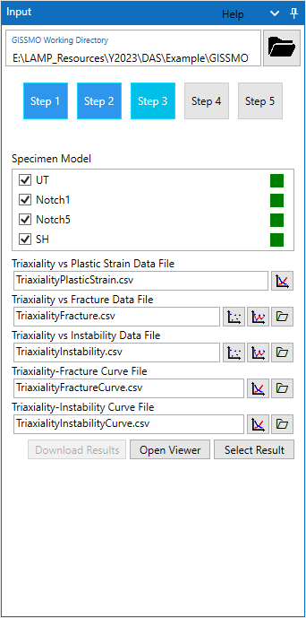

### Specimen Model
각 시편의 현재 상태를 표시합니다. 최적화 시뮬레이션이 완료된 시편 모델에 대해서 최적 결과 선택 및 Triaxiality를 계산할 수 있습니다.

- <span style="color:red">빨강</span> : 빨강색으로 Step3에서 진행된 내용이 없을 경우에 표시됩니다.
- <span style="color:orange">주황</span> : 주황색은 시편 모델의 최적화 시뮬레이션 결과의 Sampling 데이터를 읽은 상태로 아직 최적 결과가 선택되지 않은 상태입니다.
- <span style="color:green">초록</span> : 초록색은 시편 모델의 최적 결과가 선택되었고 Triaxiality가 계산된 상태를 의미 합니다.

### Selection Optimal Case
Step 2에서 최적화 시뮬레이션에서 생성된 결과들에서 사용자는 시험 target curve를 잘 표현하는 최적의 결과를 선택해야 합니다. 먼저 사용자는 LS-OPT에서 사용되는 viewer 프로그램을 통해 결과를 비교하고 최종적으로 하나의 결과를 선택합니다. 이를 위해 상단 Specimen Model 목록에서 확인하고자 하는 하나의 모델을 선택하고 제일 하단에 위치한 버튼 중에서 Open Viewer 버튼을 클릭합니다. 

:::{admonition} LS-OPT Viewer

<!--  -->

위 영상에서 확인할 수 있는 내용에 대해서 아래와 같이 설명합니다.
- FORCE_DISPLACEMENT_CURVE : 최적화 시뮬레이션을 통해서 계산된 결과의 Force-Displacement 결과 Curve를 표시합니다.
- UT_target_curve : Step 1에서 시편 모델의 시험 target curve를 표시합니다. 

(하단 Iteration에서)
- all : 모든 결과 case의 결과를 표시합니다. 이 경우 선택한 FORCE_DISPLACEMENT_CURVE 결과가 표시됩니다. 
- n : 하나의 Iteration의 결과를 표시합니다. 위 영상의 경우 총 11번의 Iteration이 수행되었으며 n을 통해 하나의 Iteration에서 생성된 simulation point 수만큼의 FORCE_DISPLACEMENT_CURVE를 표시합니다.

표시되는 그래프에서 하나의 라인을 클릭하면 해당 결과에 대한 파라미터와 Case 넘버가 표시됩니다. 따라서 사용자는 target curve의 파단 시점을 잘 표현하는 하나의 결과를 선택하고 Case를 넘버를 확인합니다.

:::

:::{admonition} Numbering of Results
:class: Tip
최적화 시뮬레이션은 최적값을 찾기 위해 몇번의 반복 계산을 합니다. 반복 계산은 각 Iteration마다 사용자가 Step2에서 설정한 Num. of Simulation Points의 수만큼 결과를 생성합니다. 즉 최적값을 찾는데 5번의 Iteration이 수행되었고 Num. of Simulation Points의 값이 8이라면 총 40개의 결과를 생성합니다. 각 결과 Case의 넘버링은 1.1~1.8, 2.1~2.8 ... 5.1~5.8과 같이 설정되며 각 넘버링으로 된 폴더에 결과가 저장됩니다. 넘버링의 앞 숫자는 Iteration 값을 뒤의 숫자는 Simulation Point를 의미합니다.
:::

:::{admonition} Selecting Optimal Result Tip
:class: Tip
대부분의 경우 LS-OPT는 최적의 결과를 제일 마지막 넘버링 값으로 저장합니다. 하지만 가끔 마지막 넘버링의 결과보다 이전 넘버링의 결과에서 더 잘 맞는 결과가 있을 수 있습니다. 그렇기 때문에 무조건적으로 마지막 넘버링의 결과를 선택하기 보다는 LS-OPT Viewer에서 결과를 확인 후에 선택하는 것이 좋습니다.
:::

### Calculation Triaxiality Value
LS-OPT Viewer에서 각 시편 모델의 최적 결과를 선택하였다면 각 시편 모델의 Triaxiality를 계산해야 합니다. LAMP GISSMO에서 Triaxiality를 쉽게 계산할 수 있습니다. 하단의 Select Result를 클릭합니다.

<!-- 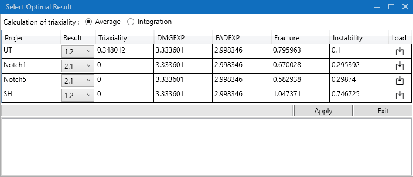 -->

- Project : 현재 사용중인 시편 모델의 이름을 표시합니다.
- Result : 최적화 시뮬레이션으로 생성된 결과의 넘버링 목록이 표시되며 LS-OPT Viewer에서 선택한 각 시편 모델의 최적 결과 Case 넘버를 선택합니다.
- Triaxiality : 선택된 Result 항목의 Case에 해당하는 결과에서 계산된 Triaxiality 값을 표시합니다. 계산 전에는 0으로 표시됩니다.
- DMGEXP, FADEXP, Fracture, Instability : 선택된 Result 항목의 파라미터 값을 표시합니다. 
- Load : 아이콘을 눌러 선택된 Result 항목의 Triaxiality를 계산합니다. 계산이 종료되면 Triaxiality 열에 계산된 값이 자동으로 입력됩니다. 

위 설명에서와 같이 Result 항목에서 최적 결과에 해당하는 넘버를 선택하고 Load 항목의 아이콘을 클릭하여 각 시편 모델의 Triaxiality를 계산합니다. 계산 후 Apply 버튼을 클릭하여 적용합니다. 적용 후에는 Triaxiality Data 파일들이 자동으로 생성됩니다. 

:::{admonition} Calculation of triaxiality
:class: Tip
Triaxiality는 평균(Average)과 적분(Integration) 방법으로 계산할 수 있습니다. 평균은 0이 아닌 값들을 평균하여 계산하며 적분 방법은 Effective Plastic Strain - Triaxiality Curve의 면적에 최대 Effective Plastic Strain을 나눈 값으로 계산합니다. 
:::

### Triaxiality Curve Data
최적화 시뮬레이션이 완료된 시편 모델들에 대해서 최적 결과를 선택하고 Triaxiality를 계산 한 후에 생성되거나 생성 할 수 있는 Curve 데이터들을 확인하거나 조작할 수 있습니다.

- Triaxiality vs Plastic Strain Data File : Triaxiality vs Plastic Strain Data가 기록된 csv파일 이름을 표시하고 우측 아이콘을 통해 그래프로 확인 할 수 있습니다.
- Triaxiality vs Fracture Data File : Triaxiality vs Fracture Data가 기록된 csv파일 이름을 표시하고 Data를 이용해 interpolation으로 Curve를 생성할 수 있습니다.
    - {w=24px} : Triaxility vs Fracture 데이터 포인터를 표시합니다.
    - {w=24px} : Triaxility vs Fracture 데이터 포인터를 기반으로 Curve를 생성 할 수 있는 도구를 표시합니다.

::::{tab-set}

:::{tab-item} H-F Failure

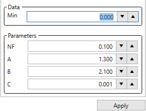

H-F Failure 탭에서는 Hosford-Coulomb Failure Model을 이용하여 Triaxiality Curve를 생성할 수 있습니다. \
해당 기능은 Curve를 데이터의 점 데이터에 알맞도록 자동으로 생성해주지 않습니다. \
사용자가 NF, A, B, C 총 4개의 파라미터를 변경하면서 점 데이터를 잘 묘사하는 Curve를 찾아야 합니다.

<!-- 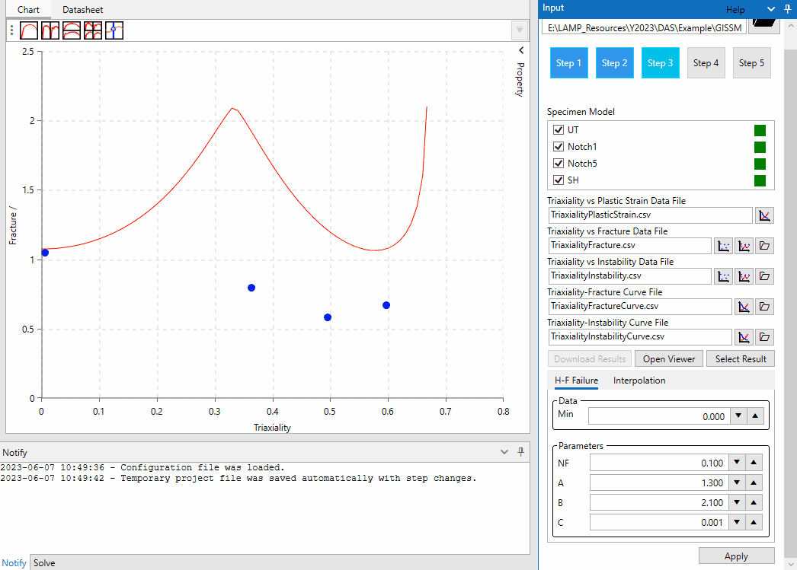 -->

:::

:::{tab-item} Interpolation

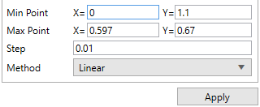

Interpolation 탭에서는 선형 및 다항식등의 방법으로 점 데이터 사이를 Interpolation하여 Curve를 생성할 수 있습니다.
LAMP GISSMO에서 지원되는 Interpolation 방법은 다음과 같습니다. \
Interpolation을 하기 위한 Min, Max Point 값과 생성할 Curve 데이터의 step 크기를 입력하고 Method를 선택 후 Apply 버튼을 눌러 Curve를 생성합니다.

- Linear
- Cubic
- Quadratic
- Newton
- Lagrange

:::

::::

## Step 4
Step 4에서는 메쉬 정규화(Mesh Regularization)을 수행합니다. 메쉬 정규화에는 Step 1에서 사용했던 시편 모델중에서 하나를 Reference로 선택해야 합니다. 선택된 시편모델에 대해서 실제 인장으로 변형되고 변위가 계산되는 요소의 사이즈를 달리하는 최소 3개의 시편 모델이 요구 됩니다.

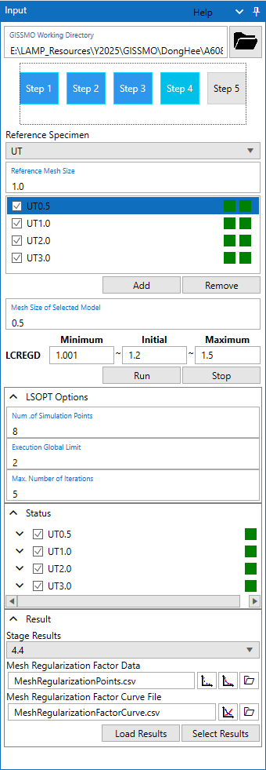

:::{admonition} Mesh Regularization
:class: Tip
재료의 파단은 메쉬 사이즈에 따라서 UTS 이후 결과에 차이가 있고 비선형 거동의 경우 메쉬 사이즈에 큰 영향을 받습니다. 실제 일정한 메쉬 사이즈에서 도출된 GISSMO 데이터를 일정하지 않은 해석 모델에 적용할 경우 부정확한 결과를 보일 수 있습니다. 따라서 메쉬 사이즈에 따른 Scaling Factor Curve를 생성하여 GISSMO에 적용합니다. 일반적으로 Reference 모델의 메쉬 사이즈는 0.5mm로 하며 메쉬 정규화를 위한 시편 모델은 0.4mm, 0.8mm, 1.5mm로 구성합니다. 0.5mm 일 때의 Scaling Factor를 1로 하여 LS-OPT 최적화 시뮬레이션으로 0.4mm, 0.8mm, 1.5mm일 때의 Scaling Factor 계산합니다. 결과적으로 총 4개의 Scaling Factor를 사용하여 Curve Fitting으로 Curve를 생성하고 GISSMO 물성 카드에 적용합니다. 
:::

### Selection of Reference Model
- Reference Speciment : 하나의 Reference 모델을 선택합니다. 일반적으로 단순한 Uniaxial 모델을 사용합니다.
- Reference Mesh Size : Reference 모델의 메쉬 사이즈를 입력합니다.

### Add Specimen Model
사전에 준비된 시편 모델들을 Add 버튼을 클릭하여 추가합니다. Step 4에서 추가된 모델들은 두 개의 상태로 진행 상황을 개략적으로 확인할 수 있습니다.

:좌측 상태 박스:
- <span style="color:red">빨강</span> : 메쉬 정규화에 대한 최적화 시뮬레이션이 수행되지 않았음을 나타냅니다.
- <span style="color:orange">주황</span> : 메쉬 정규화에 대한 최적화 시뮬레이션이 진행중임을 나타냅니다.
- <span style="color:green">초록</span> : 메쉬 정규롸에 대한 최적화 시뮬레이션이 정상적으로 수행되었음을 나타냅니다.

:우측 상태 박스:
- <span style="color:red">빨강</span> : Step 3과 유사하게 결과 선택에 있어 진행된 내용이 없음을 나타냅니다.
- <span style="color:orange">주황</span> : 최적화 시뮬레이션의 Sampling 결과 데이터를 읽은 상태로 아직 최적 결과가 선택되지 않았음을 의미합니다.
- <span style="color:green">초록</span> : 최적 결과가 선택되었으며, Scaling Factor 데이터를 이용한 Curve Fitting이 가능한 상태를 나타냅니다.

### Input Data & Simulation
Step 4에서 메쉬 정규화를 위해 추가한 모델의 정보를 입력합니다. 입력은 시편 모델 리스트에서 하나의 모델을 선택 후에 입력합니다. 

- Mesh Size : 선택한 시편모델의 메쉬 사이즈를 입력합니다. 추가한 시편 모두에 대해서 입력해줍니다.
- LCREGD : LCREGD는 LS-OPT 최적화 시뮬레이션에서 결정되는 변수로 최적 값을 찾기 위한 초기값 및 범위를 입력합니다. 추가한 시편 모두에 대해서 입력해 줍니다.
- Run : 각 시편 모델의 필요 정보를 모두 입력하였다면 Run 버튼으로 최적화 시뮬레이션을 수행합니다.
- Stop : 진행중인 LS-OPT 최적화 시뮬레이션을 중단합니다.

:::{Tip}
메쉬 정규화에서 실행하는 최적화 시뮬레이션의 Solver 및 LS-OPT 옵션들은 모두 Step 2에서 설정된 값을 사용합니다.
:::

### Result of Mesh Regularization
최적화 시뮬레이션이 정상적으로 종료되었다면 결과를 로드 하고 Step 3에서 진행했던 것과 같이 최적 결과를 선택합니다.

- Load Results : 메쉬 정규화를 위해 추가했던 시편 모델의 시뮬레이션 결과를 로드합니다. 정상적으로 결과가 로드되면 Stage Results란에 각 시편 모델의 결과 Stage 넘버 목록이 표시됩니다. 
- Stage Results : ```선택한 시편 모델```의 결과 Stage 넘버 목록이 표시됩니다. 제일 마지막 Stage 넘버를 선택합니다.
- Select Results : 결과를 로드하고 각 시편 모델의 Stage 넘버를 선택하였다면 Select Results 버튼으로 선택된 결과를 결정합니다. 결과를 결정하기 되면 Mesh Regularization Factor Data 파일이 생성됩니다. 

### Generate Mesh Regularization Factor Curve
LS-Dyna GISSMO 물성에 메쉬 사이즈의 Scaling Factor를 적용하기 위해서 결정된 데이터로 Curve Fitting을 하여 Curve를 생성합니다. 

- Mesh Regularization Factor Data : 최적화 시뮬레이션으로 결정된 각 시편 모델의 Scaling Factor 데이터가 저장된 csv 파일을 표시합니다. 

    - {w=24px} : csv 데이터 파일에 저장된 포인트 정보를 그래프로 표시합니다.
    - {w=24px} : Scaling Factor 포인트 정보를 기반으로 Curve Fitting을 할 수 있는 도구를 표시하고 Curve Fitting을 하여 Curve를 결정합니다. 

        - Data 항목에서 생성할 Curve 가로축의 Min, Max 값과 Step 사이즈를 설정합니다.
        - Curve Fitting은 두 개의 지수함수 모델을 사용할 수 있습니다. 각각의 버튼을 클릭 시 Curve Fitting이 바로 적용되며 A, B 그리고 C 값이 표시됩니다. 사용자는 임의로 A, B, C 값을 변경하여 Curve를 수정할 수 있습니다.
        - Curve를 결정한 이후에는 Apply 버튼을 클릭하여 생성된 Curve 데이터를 csv 파일로 저장합니다.
        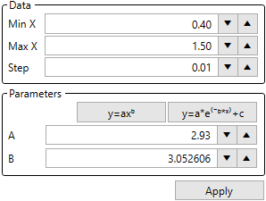


- Mesh Regularization Factor Curve File : Curve Fitting을 통해 생성된 Curve 데이터가 저장된 파일을 표시합니다.

## Step 5
Step 5에서는 Ste 1 ~ 4를 진행하면서 얻은 결과들을 이용해서 LS-Dyna에서 사용가능한 GISSMO 물성 카드가 포함된 키워드 파일을 생성합니다.

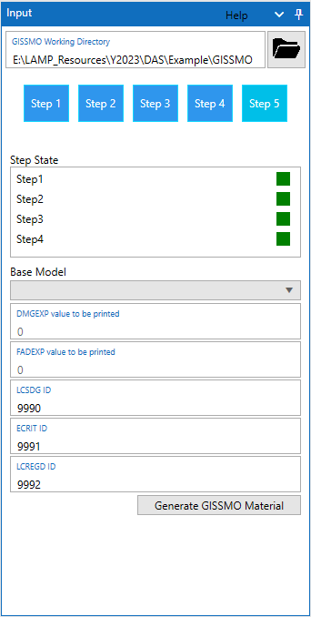

- Step State : 이전 Step들의 상태를 표시합니다.
    - <span style="color:red">빨강</span> : 진행된 내용이 없음을 나타냅니다.
    - <span style="color:orange">주황</span> : Step 1~4에서 누락된 입력 및 내용이 있음을 나타냅니다.
    - <span style="color:green">초록</span> : Step 1~4가 문제 없이 정상적으로 완료되었음을 나타냅니다.

- Base Model : GISSMO 카드의 DMGEXP 와 FADEXP의 값을 가져올 모델을 선택합니다. 
- LDSDG, ECRIT, LCREGD ID : GISSMO 카드에 입력되는 이 세 파라미터의 데이터는 Curve 데이터로 생성되는 결과물인 키워드 파일에 Step 3~4에서 결정한 3개의 Curve 데이터가 각각 DEFINE_CURVE 카드에 정의됩니다. 이 세 입력란에 입력하는 ID는 각각의 DEFINE_CURVE의 ID입니다. 

:::{hint}
ECRIT의 ID는 GISSMO 카드에 마이너스 값으로 변경되어 입력됩니다. 마이너스의 의미는 ECRIT의 데이터로 Curve를 사용하겠다는 의미입니다. `사용자가 입력하는 UI의 ECRIT ID 입력란에는 마이너스가 아닌 플러스 값으로 입력해야 합니다.`
:::

생성되는 결과물은 아래와 같습니다.

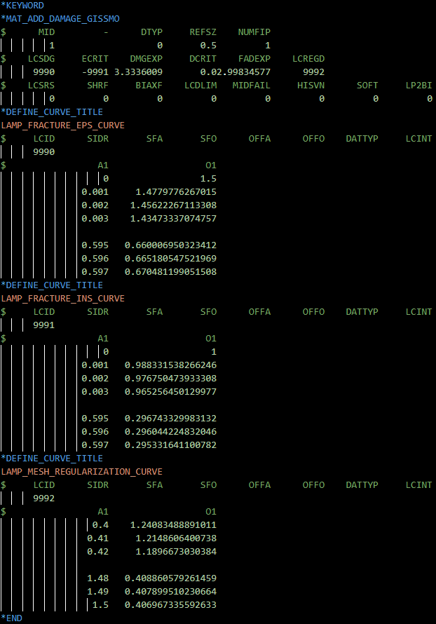

