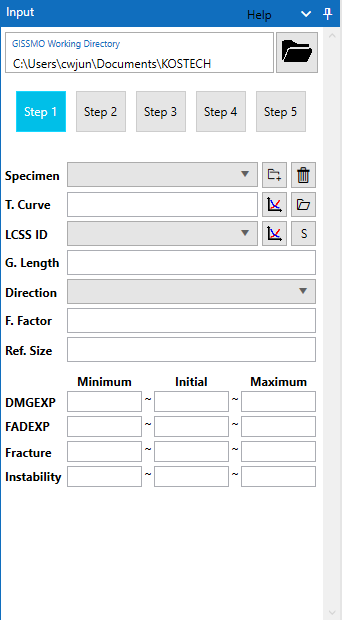
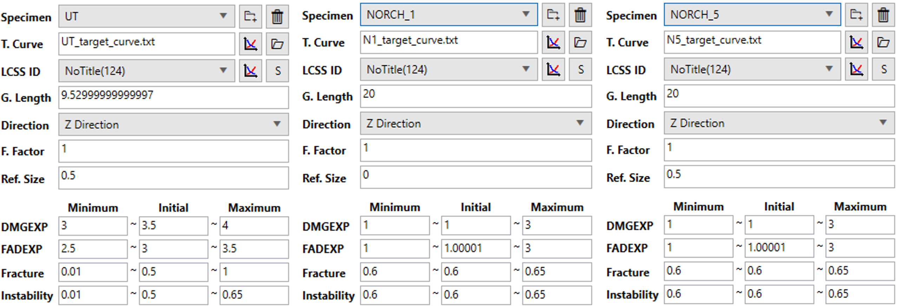

# Samples of LAMP

## LAMP GISSMO

LAMP에서 사용할 수 있는 GISSMO 인터페이스를 직접적으로 테스트 할 수 있도록 제공되는 Sample 파일을 통해 LAMP GISSMO를 이용하여 GISSMO 물성을 출력하는 과정을 살펴 봅니다. 설명되는 내용은 개략적은 사용법을 설명하는 것으로 생성되는 결과는 유효한 데이터가 아님을 참고하시기 바랍니다.

### Sample files

제공되는 LAMP GISSMO Sample 파일에 대해서 아래의 내용을 참고하시기 바랍니다.

- 2.0.5 버전 이상에서 테스트 되었습니다.
- Sample 파일은 총 2개의 폴더로 구성되어 있으며 각각의 폴더에 시뮬레이션에 사용되는 시편모델이 있습니다.
  - Regularization : Mesh 정규화를 위한 0.5, 1.0, 2.0, 3.0 사이즈의 UT 시편 모델을 포함하고 있습니다.
  - Specimen : Shear, 5mm Norch, 16mm Norch, UT 시편을 포함하고 있습니다.

### Check Points

GISSMO 모델 생성에 사용되는 시편모델에는 LS-OPT의 파라미터 최적화 해석에서 시편에 작용하는 하중에 대한 Displacement(변위)를 계산할 수 있도록 두 노드점과 인장 Force를 확인하기 위한 하나의 노드를 정의하여야 합니다. **노드점의 정의는 *DATABASE_HISTORY_NODE 카드에 정의**해야 합니다.

### Working Directory

제일 먼저 작업 디렉토리를 설정합니다. 기본값으로는 내문서/KOSTECH 폴더로 설정되어져 있기 때문에 되도록이면 시편모델들이 위치하고 있는 디렉토리로 설정하시고 사용하는 것으로 추천드립니다.

### Step 1

Step 1에서는 시편 모델을 추가하고 필요한 정보를 입력하는 단계입니다. 아래 나열된 순서로 시편모델을 추가합니다.

- Specimen란의 {class="intxt-image"} 아이콘을 클릭하고 UT 폴더의 UT_999_COONTROL_CARD.DYN 파일을 선택합니다.
- T. Curve란의 {class="intxt-image"} 아이콘을 클릭하고 UT_target_curve.txt 파일을 선택합니다.
- Ref. Size 입력란에 시편모델의 mesh size인 1.0를 입력합니다.
- DMGEXP, FADEXP, Fracture, Instability의 값 범위를 아래 사진의 제일 왼쪽 사진과 같이 입력합니다.
- NORCH_1, NORCH_5 시편 모델에 대해서도 동일하게 진행하며, 두 시편모델에 대해서는 DMGEXP, FADEXP, Fracture, Instability를 현재 단계에서 따로 수정하지 않습니다.
- 3 개의 시편모델 추가가 완료한 후 그림 1과 같이 입력되었는지 확인합니다.

#### 그림 1. Step 1의 시편모델 추가 완료 상태

:::{Tip}
여기서 설명되는 내용은 시편 모델을 순차적으로 최적화 시뮬레이션하는 방법을 설명합니다. 이 경우 일반적으로 UT 시편 모델에 대해서 먼저 DMGEXP, FADEXP, Fracture, Instability를 결정한 후 UT 시편 모델의 DMGEXP, FADEXP 두 파라미터를 다른 시편 모델(NORCH_1, NORCH_5)의 DMGEXP, FADEXP에 상수(constant) 파라미터로 입력한 후에 다른 시편 모델의 Fracture와 Instability 파라미터를 최적화 시뮬레이션으로 결정하게 됩니다.
:::

### Step 2

Step 2에서는 Step 1에서 추가된 시편모델에 대해서 LSOPT 최적화 시뮬레이션을 수행하는 단계입니다. 본 페이지에서 입력하는 값들은 모두 설명을 위해 임의로 설정한 값입니다. 실제 적용하실 때에는 상황에 맞는 값들을 입력하시기 바랍니다.

:::{attention}
여기서는 local 환경(On client)에서 R11.1.0의 smp single 솔버를 사용하며 LSOPT 6.0 버전으로 하였습니다. 필요에 따라 LS-Dyna 솔버를 변경하시고 mpp 솔버를 사용하는 경우 MPI Path에 MPI 경로를 설정하셔야 합니다. MPI Path는 mpirun, mpiexec 파일이 존재하는 폴더 경로입니다. LSOPT는 6.0에서 테스트 되었기 때문에 상위버전에서 정상적으로 진행되지 않을 가능성이 있습니다. 서버 장비(On server)에서 LSOPT 최적화 시뮬레이션을 진행하기 위해서는 사용 환경에 맞추어 테스트가 요구되기 때문에 사용을 원하시면 KOSTECH으로 문의주시기 바랍니다.
:::

- Local 환경(On client) 상태에서 Solver를 선택하기 위해 Solver란의 ... 버튼을 클릭하여 LS-Dyna 솔버가 위치하고 있는 폴더를 선택합니다.
- 선택된 폴더에 LS-Dyna 솔버(ls-dyna로 시작하는 파일)가 존재한다면 ComboBox에 솔버가 표시되며 사용하고자 하는 솔버를 선택합니다.
- LSOPT란의 ... 버튼을 클릭하여 LSOPT 실행 파일이 위치하고 있는 폴더를 선택합니다. 테스트를 위해 7.0 버전을 선택합니다.
- NCPU를 사용자 PC 환경에 따라 적절한 코어 수를 선택합니다. 코어수는 LSOPT Option의 Num. of Simulation Points와 Execution Global Limit 값에 따라 시뮬레이션에 사용되는 총 코어 수가 결정되기 때문에 [LSOPT Option](./lamp_gissmo#lsopt-option)을 참고하여 설정하시기 바랍니다.
- Num. of Simulation Points은 16으로 설정하고 Execution Global Limit 2로 입력합니다.
- LSOPT Project Generation에서는 Integration을 선택합니다.
- Card Type으로 MAT ADD DAMAGE GISSMO 카드를 선택하고 진행합니다.
- 입력이 완료 되면 Run 버튼을 클릭하여 최적화 시뮬레이션을 진행합니다.
- 해석이 성공적으로 종료되면 Status의 UT 항목의 우측 사각형이 초록색으로 변경됩니다.

:::{admonition} LSOPT Project Generation
:class: tip
LSOPT Project Generation에서 Invdividual은 각 시편모델에 대해서 따로 lsopt 파일을 생성하고 시뮬레이션을 진행하는 방법입니다. Integration은 모든 시편을 하나의 lsopt 프로젝트에 포함시켜서 한번의 시뮬레이션으로 결과를 도출하는 방법입니다.
:::

### Step 3

Step 3에서 종료된 최적화 시뮬레이션 결과로 부터 하나의 최적 값을 선택하고 Triaxiality 및 Curve를 생성하는 단계입니다.
우선 UT 시편모델을 먼저 시뮬레이션을 수행했기 때문에 UT 모델의 DMGEXP와 FADEXP 값에 대한 최적 값을 선택해야 합니다.
Step 3에서 하단의 Open Viewer를 클릭하여 LS-OPT Viewer를 실행합니다. 표시되는 LS-OPT Viwer 창에서 [Selection Optimal Case](./lamp_gissmo#selection-optimal-case)를 참고하여 DMGEXP와 FADEXP 값을 결정합니다. 아래 나열된 순서를 따라서 NORCH_1, NORCH_5 시편 모델에 대해서 최적화 시뮬레이션을 진행합니다.

- 결정된 UT의 DMGEXP와 FADEXP 값을 NORCH_1과 NORCH_5의 DMGEXP, FADEXP의 min, initial, max에 모두 동일하게 입력합니다. 동일하게 입력하게 되면 상수(constant) 파라미터로 설정됩니다. 
- NORCH_1과 NORCH_5의 fracture와 instability 범위를 아래 사진과 같이 입력합니다.

    

- Step 2로 이동한 후 Status에서 UT 항목의 체크를 해제하시고, NORCH_1과 NORCH_5를 체크하고 Run으로 최적화 시뮬레이션을 수행합니다.
- NORCH_1, NORCH_5 모델도 마찬가지로 시뮬레이션이 정상적으로 정료되고 사각형이 초록색으로 변경되었다면 Step 3으로 이동합니다.

#### Triaxiality 계산 및 Curve 생성

UT, NORCH_1, NORCH_5 시편 모델 모두 최적화 시뮬레이션이 마무로되었다면 각 시편 모델에 대해서 최적값이라고 판단되는 case 넘버를 선택해야 합니다. 다시 한번 [Selection Optimal Case](./lamp_gissmo#selection-optimal-case)를 참고하여 각 시편에 대해 최적해라고 판단되는 case 넘버를 선택합니다. case 넘버를 선택하였다면 [Calculation Triaxiality Value](./lamp_gissmo#calculation-triaxiality-value)를 참고하여 Triaxiality를 계산합니다. 여기서는 3개의 시편 모델을 사용했기 때문에 3개의 항목만 Select Optimal Result 창에 표시될 것입니다. 이 후 [Triaxiality Curve Data](./lamp_gissmo#triaxility-curve-data) 항목을 참고하여 curve를 생성하는 내용이 있지만 여기서는 자세하게 다루지 않으며 향후에 curve를 생성하실 때 [Triaxiality Curve Data](./lamp_gissmo#triaxility-curve-data) 항목을 참고하시기 바랍니다.

### Step 4 - Step 5

Step 4는 sample 파일에 포함된 Mesh_Regularization 폴더의 Reg04, Reg08, Reg15 폴더에 있는 UT 모델의 0.4, 0.8, 1.5 메쉬 크기를 가지는 모델을 이용하여 [Step 4](./lamp_gissmo#step-4), [Step 5](./lamp_gissmo#step-5) 항목을 참고하셔서 진행하시면 됩니다. 