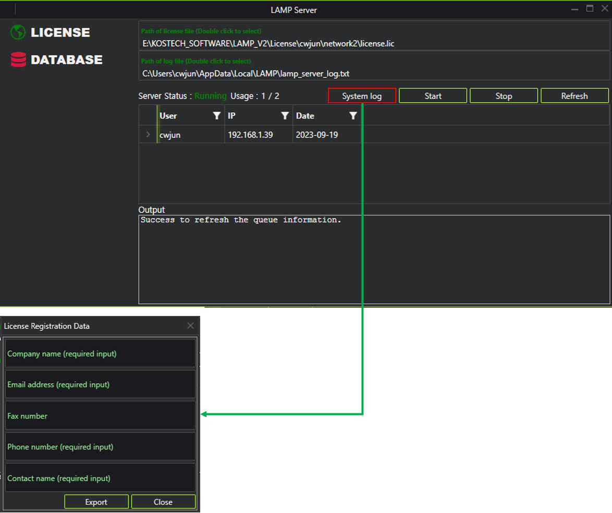
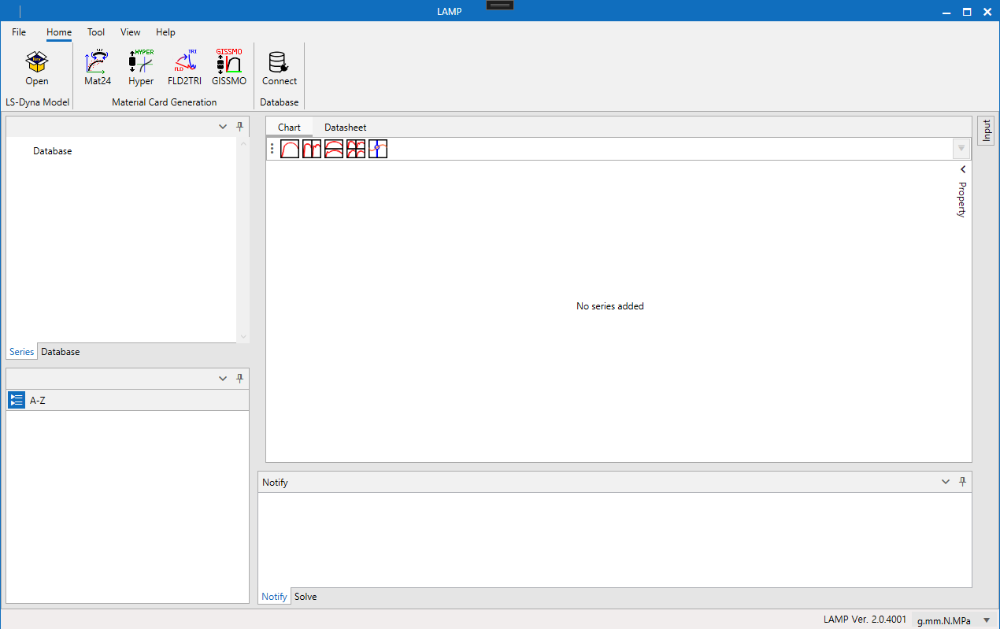

# 시작하기

## 1. Introduction
LAMP(LS-Dyna Advanced Material Platform)는 한국시뮬레이션기술에서 개발하고 있는 프로그램으로 LS-Dyna 사용자들이 재료 물성 카드를 생성 및 관리할 수 있도록 다양한 기능들을 제공하여 LS-Dyna 해석 소프트웨어 활용에 편의성을 제공합니다. LAMP는 현재 한국시뮬레이션기술에서 LS-Dyna를 구매하고 유지보수를 유지하고 계시는 고객들에게 제공되고 있습니다.

현재 LAMP에서 사용할 수 있는 기능은 다음과 같습니다.

### [1.1 시험데이터를 이용한 Steel 계열 LS-Dyna 물성 카드 생성](./gen_material.md)
- 시험 raw 데이터의 Curve Fitting
- Ludwick, Swift, Voce, Kim-Tuan, Mixed Swift-Voce 모델 사용 가능
- Johnson-Cook 모델의 strain rate를 고려한 Curve Fitting
- 생성된 물성 데이터의 데이터베이스 저장

### 1.2 시험데이터를 이용한 LS-Dyna Hyperelastic 물성 카드 생성
- MOONEY-RIVLIN (MAT27), HYPERELASTIC Order 1 ~ 3 (MAT77), OGDEN Order 1 ~ 3 (MAT77) 사용 가능

### [1.3 개인 물성 관리를 위한 데이터베이스 제공 및 현대제철 물성 데이터베이스 제공](./database.md)
- MySQL 기반의 MariaDB를 이용한 데이터베이스 제공
- 사용자 개인 물성 저장 및 출력 인터페이스 제공(일부 LS-Dyna 물성 카드만 지원)
- Steel 계열의 현대 제철 물성 데이터 제공

### [1.4 GISSMO 물성 생성을 위한 인터페이스 기능](./lamp_gissmo.md)
- GISSMO 물성 생성을 위한 LS-OPT 및 LS-DYNA의 시뮬레이션 인터페이스 제공
- LS-OPT를 이용한 GISSMO 물성 파라미터의 최적화 및 Mesh Regularization 가능
- Triaxiality 계산 기능 및 Triaxiality Curve 생성을 위한 수치 도구 제공
- LS-Dyna에서 사용 가능한 GISSMO 물성 카드 생성

## 2. Installation
LAMP 설치를 위해 아래 링크에서 다운로드 받은 후에 압축을 해제 합니다. 압축 해제 후 LAMP Installer.exe 파일을 실행하면 아래와 같은 설치 화면이 표시됩니다. 

:::{tip}
데이터베이스를 따로 서버 PC에 구성하지 않고 로컬 환경에서 사용하시려면 로컬(사용자) PC에 LAMP와 LAMP Server를 모두 설치 합니다.
:::

### 2.1 경로 변경 
설치 경로는 Install directory 우측 아이콘을  클릭 하여 변경 할 수 있습니다.
### 2.2 LAMP Server
LAMP에서 제공하고 데이터베이스 및 네트워크 라이선스를 관리 할 수 있는 프로그램입니다. 데이터베이스 기능을 사용하기 위해서 반드시 설치 하여야 합니다.
### 2.3 LAMP
한국시뮬레이션기술에서 LS-Dyna 고객들에게 제공되는 프로그램으로 LS-Dyna 재료 물성 카드의 보다 쉽고 편리한 생성 및 관리 등의 기능을 제공합니다.

## 3. License 발급
LAMP 설치 이후에 LAMP를 사용하기 위해서는 한국시뮬레이션기술에서 라이선스를 제공받으셔야 합니다. 현재 LAMP 개발 진행중인 소프트웨어로 한국시뮬레이션에서 LS-Dyna를 구매하고 유지보수를 유지하고 계시는 고객들에게 2개월동안 사용가능한 라이선스가 발급됩니다. 로컬 PC 1대에 사용가능한 stand-alone license와 서버 PC 1대에 license를 위치 시키고 1대 이상의 client PC에서 사용가능한 network license를 사용할 수 있습니다. 라이선스 발급은 라이선스 파일이 위치할 PC의 로그 정보를 한국시뮬레이션기술에 제공해주시면 해당 PC에 대한 라이선스를 발급해드립니다.

### 3.1 Stand-alone license
개인 local PC 1대에 LAMP를 사용하기 위한 라이선스로 LAMP 설치 시 함께 설치되는 LicenseManager에서 로그 파일을 생성 할 수 있으며, 발급되는 라이선스를 등록할 수 있습니다. 

#### 로그 파일 생성
LicenseManager를 실행하고 상단 Export 메뉴에서 Log file 메뉴를 클릭하면 생성되는 창에서 요구되는 정보를 입력하고 Save log file 버튼으로 log 파일을 저장 후 한국시뮬레이션기술에 로그 파일을 보냅니다.

#### 라이선스 파일 등록
제공되는 라이선스 파일은 LicenseManager에서 등록을 해야 합니다. LicenseManager를 실행 하시고 License Type을 Stand-alone으로 선택합니다. \
License Path의 Browse를 클릭한 후 제공된 라이선스 파일을 선택하고 Apply를 눌러 라이선스를 등록합니다.

### 3.2 Network license
#### 로그 파일 생성 (서버 PC)
네트워크 라이선스를 발급받기 위해서는 LAMP Server에서 로그 파일을 생성해야 합니다. 

- LAMP Server를 실행하고 LICENSE 탭을 선택합니다.
- System log 버튼을 클릭합니다.
- 필수 정보(Company name, Email address, Phone number, Contact name) 입력 후 Export 버튼으로 파일 생성

#### 라이선스 파일 등록 (서버 PC)
제공되는 라이선스는 서버 PC에서 LAMP Server를 통해 등록합니다.

- LAMP Server를 실행하고 LICENSE 탭을 선택합니다.
- Path of license file 입력란에 제공받으신 라이선스 파일 경로를 입력 및 더블 클릭하여 선택합니다.
- Start 버튼을 클릭 후 Server Status의 Text가 Running으로 표기되는지 확인합니다.
- 라이선스 서버가 제대로 시작되지 않는다면 lamp_server_log.txt, lamp_server_app_log.txt 파일과 함께 KOSTECH에 문의주시기 바랍니다.

:::{admonition} path of log file
:class: note
lamp_server_log.txt와 lamp_server_app_log.txt 파일은 C:/Users/{현자 사용자 이름}/AppData/Local/LAMPS에 있습니다.
:::

#### Clinet PC에서 라이선스 활성화
서버에 등록된 라이선스를 클라이언트 PC에서 사용하기 위해서 LicenseManager를 통해 등록합니다.

- LicenseManager를 실행합니다.
- License Type을 Network로 선택하고 서버의 IP Address를 입력 후 Apply 클릭합니다.
- 완료되었다는 메세지가 표시될 때까지 기다립니다.

:::{admonition} Network port of license server
:class: note
LAMP 라이선스 서버는 기본적으로 27015 포트를 사용합니다. Client PC에서 라이선스 활성화가 되지 않는다면 \
방화벽 설정을 확인하시기 바랍니다. 현재 포트 번호를 변경하여 사용하는 것은 지원되지 않습니다.(향후 추가 예정)
:::

## 4. 데이터베이스 설정
LAMP에서 제공하는 데이터베이스는 MariaDB에서 테스트 되었으며, 사용을 위해 서버 PC에 MariaDB를 설치 해야 합니다. 
### 4.1 MariaDB 설치
설치를 위해 아래 경로에서 다운로드 받고 설치 합니다. MariaDB 설치 과정에서 root 사용자에 대한 비번을 입력 하고 'Enable access from remote machines for 'root' user에 체크 합니다.

<https://dlm.mariadb.com/1913768/mariadb/mariadb-10.5.13/winx64-packages/mariadb-10.5.13-winx64.msi>

### 4.2 현대제철 물성 추가
LAMP는 현대제철의 Steel 계열의 물성을 제공합니다. 현대제철 물성을 사용하기 위해서는 제공되는 현대제철 물성을 데이터베이스에 추가하여야 합니다.

- LAMP Server 실행 후 DATABASE 탭을 클릭합니다.
- Connection을 선택하고 표시되는 Database Connection 창에서 정보를 입력하고 Connect 버튼을 클릭합니다.
- Connection Status에 Connected 텍스트로 표시되는 것을 확인합니다.
- Import 버튼을 클릭 후 LAMP Server 설치 경로의 data 폴더에 있는 hyundaisteel_db.sql 파일을 선택합니다.
- hyundaisteel_db 데이터베이스 항목이 추가 되었는지 확인합니다.
- Menu 열의 . . . 버튼을 클릭 후 Load 버튼을 클릭합니다.
- Status 열의 텍스트가 Unloaded에서 Loaded로 변경되었는지 확인합니다.

:::{admonition} Tip
:class: Tip
LAMP Server의 기본 설치 경로는 C:\KOSTECH\LAMPS 입니다. \
LAMP에서 현대제철 물성을 출력하는 방법은 [현대제철 물성 출력](./database.md#1-mariadb-설치-및-현대제철-물성)의 내용을 확인하세요.
:::

## 5. LAMP 메인 User Interface

