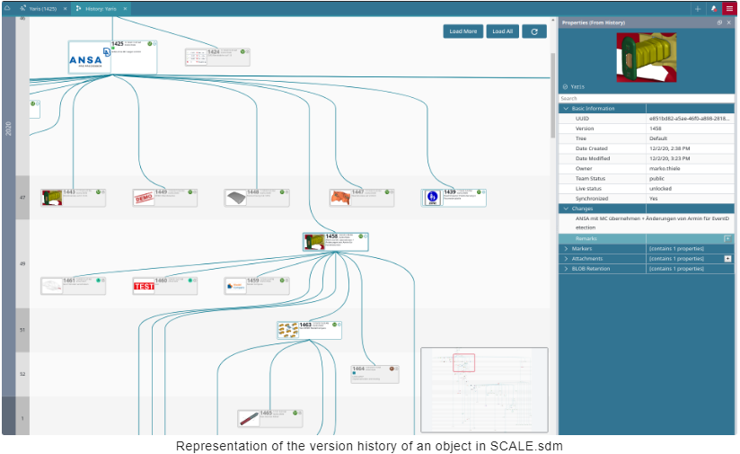
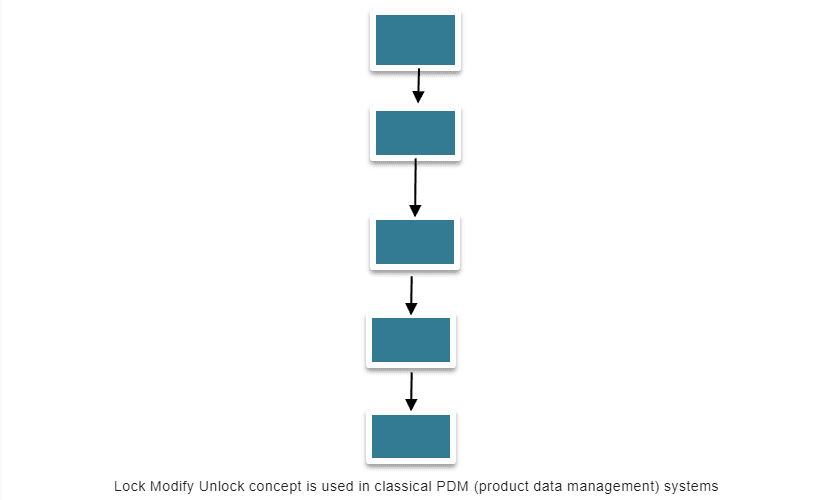
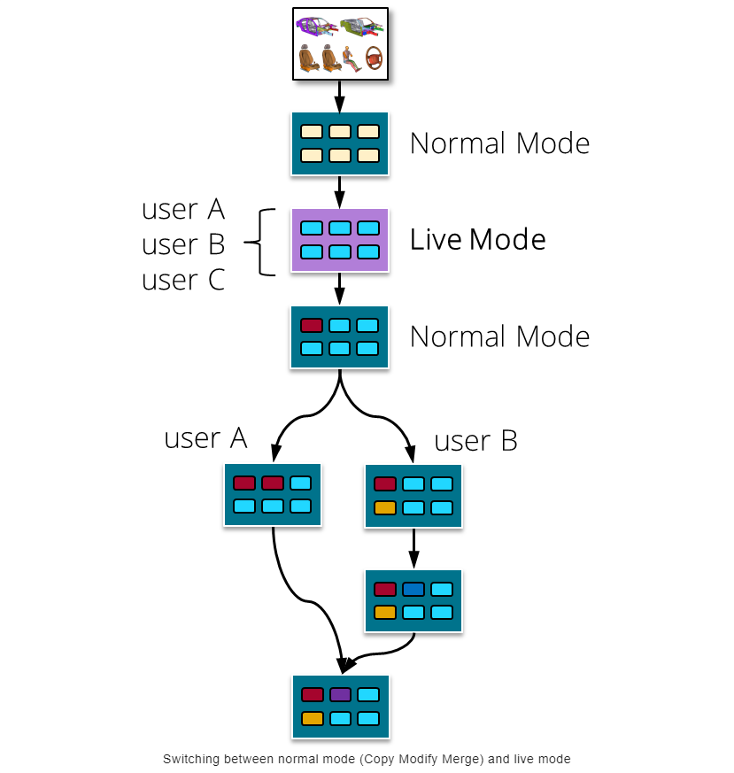
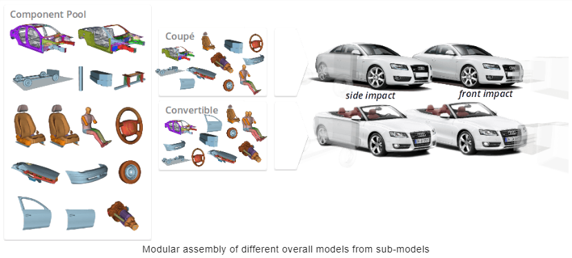
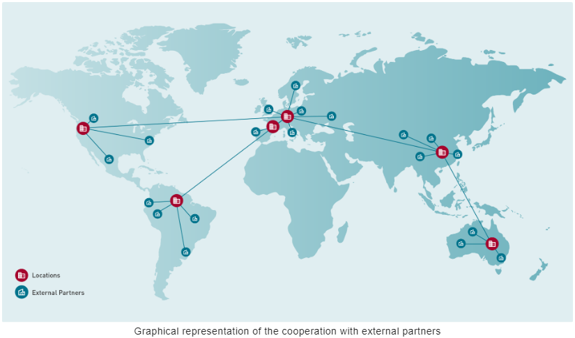
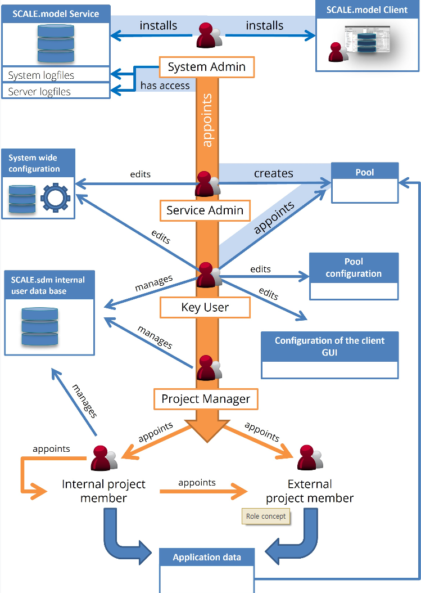

# SCALE.Model

## Basic concepts

### Workflow, teamwork and synchronization

#### Synchronization
데이터는 SCALE.sdm 서버 중앙에 보관되며, Model 클라이언트는 데이터의 로컬 복사본을 다운로드 합니다. 복사본은 Model 서버와 정기적으로 동기화되며, 이는 클라우드와 같은 인프라에 해당합니다. 로컬 작업 복사본을 기반으로 오프라인에서 작업할 수 있으며, 데이터 전송 및 데이터 저장을 위한 암호화(2단계 인증 및 암호화)를 구성하여 보안을 보장할 수 있습니다.

#### Offline / online
사용자는 서버와 정기적으로 동기화되는 로컬 데이터로 작업합니다. 일시적으로 서버에 연결할 수 없는 경우에도 사용자는 계속 작업할 수 있습니다(오프라인 모드). 서버 연결이 다시 설정되는 즉시 로컬 수정 사항이 서버에 업로드됩니다.

### Version management
버전 관리는 Model로 관리되는 데이터의 변경 사항을 추적할 수 있습니다. 모든 변경 사항을 기록하여 누가 언제 무엇을 변경했는지 추적할 수 있으며 이전 상태와 새 상태를 비교할 수 있습니다. 또한 필요에 따라 이전 상태를 복원할 수 있습니다.

Model의 거의 모든 개체들은 다음을 포함하는 버전으로 관리됩니다.

- Model data
    - Solver files
    - Preprocessor files
    - Geometry
    - Control and configuration files
- Scripts
- Parameter tables
- Folders

    

#### Lock - modify - unlock
일반적으로 PDM 시스템에서 데이터 개체는 사용자가 요청하는 즉시 다른 사용자를 위해 잠깁니다. 이 잠금-수정-잠금 해제 방식을 사용하면 한 번에 한 명의 사용자만 데이터를 수정할 수 있지만 데이터 일관성(버전 기록에서 분기되지 않음)이 보장됩니다.

#### Copy - modify - merge
모델에서는 기본적으로 복사-수정-병합 접근 방식을 따릅니다. 이 개념을 사용하면 여러 사용자가 해당 객체의 복사본을 만들어 객체를 동시에 변경할 수 있습니다. 따라서 하나의 (부모) 객체에서 여러 개의 (자식) 객체를 만들 수 있습니다. 이러한 (하위) 개체를 하나의 개체로 병합하기 위해 Model은 소위 비교 및 병합 기능을 제공하며, 이를 통해 변경 사항을 병합할 수 있습니다.

복사-수정-병합 방법은 두 가지 상태를 허용합니다.

- public(공개): 공개 상태의 개체는 더 이상 편집할 수 없습니다. 이러한 개체를 편집하면 자동으로 비공개 상태의 새 개체가 생성됩니다.

- private(비공개): 비공개 상태의 개체는 소유자만 편집할 수 있습니다. 소유자는 언제든지 비공개 개체를 공개 상태로 변경할 수 있습니다. 공개 및 비공개 개체는 모두 모든 사람에게 표시됩니다. 즉, 모든 사용자가 누가 어떤 개체에 대해 작업하고 있는지 볼 수 있습니다.

#### Live mode
모델에서 기존의 복사-수정-병합 방식에서 벗어나 특정 프로젝트 단계에서 새 버전을 만들지 않고 그룹화된 구성 요소(풀 버전)에 대해 동시에 작업할 수 있습니다. 이를 위해 구성 요소는 모델에서 라이브 모드라는 이름을 가진 잠금-수정-잠금해제 모드에서 편집됩니다. 변경한 내용은 새 버전을 만들지 않고도 작업 그룹의 다른 모든 사용자에게 즉시 표시됩니다. 프로젝트의 이 단계가 완료되면 라이브 모드 그룹을 공개로 설정하여 일반 모드(복사-수정-병합)로 원활하게 전환할 수 있습니다.

:::{note}
라이브 모드에서는 버전 기록이 일반 모드(복사 수정 병합)와 같은 정도로 문서화되지 않습니다. 라이브 모델은 클라이언트가 서버에 연결할 수 있는 경우에만 사용할 수 있습니다.
:::

### Basic principles of the modular approach

시뮬레이션에서 모듈식 접근 방식의 아이디어는 전체 모델의 개별 부분을 언제든지 교체하거나 여러 부분 모델에서 서로 다른 전체 모델을 조립할 수 있도록 하는 것입니다.

### Integration of external CAE tools
Model은 다양한 CAE 프로세스와 CAE 툴의 통합을 위한 여러 애플리케이션 인터페이스를 제공합니다. Model에서 외부 프로그램으로 파일을 직접 열어 그곳에서 처리할 수 있습니다. 처리가 완료되고 파일이 닫히면 새 버전의 객체가 자동으로 Model로 다시 임포트되고 사용자에게 히스토리 주석과 함께 변경 사항을 문서화하도록 요청합니다.

Model에서 통합될 수 있는 외부 프로그램은 다음과 같습니다.

- Pre-and post-processors such as ANSA, Hypermesh, Primer, ADAMS
- Text editors such as NEdit, gvim, Notepad++, UltraEdit
- Custom user scripts
- Optimisation tools

### Cooperation with external partners

기업들은 종종 회사 내부 네트워크에 직접 통합되지 않은 외부 서비스 제공업체에 개발 활동을 아웃소싱합니다. 외부 파트너는 서비스 포털을 통해 회사 네트워크와 모델 서버에 연결되는 것이 바람직합니다. 이렇게 하면 모든 관련 데이터가 외부 사용자와 자동으로 동기화됩니다. 외부 서비스 제공업체는 내부 직원과 동일한 개발 환경을 사용할 수 있습니다. 대역폭이 낮은 경우에도 외부 사용자는 고성능으로 자신의 데이터에 액세스할 수 있으며 주어진 개발 프로세스에 직접 참여할 수 있습니다.

외부 직원이 (내부) 중앙 모델 서버에 직접 액세스할 수 없는 경우 작업 상태를 자동으로 동기화할 수 없습니다. 그럼에도 불구하고 일관되고 가장 중요한 협업 작업 절차를 가능하게 하기 위해 Model은 외부 파트너의 IT 시스템 내에서 보조 서버라고 하는 로컬 Model 서버를 실행할 수 있는 기능을 제공합니다.

이러한 시나리오에서는 두 개의 모델 서버를 구분합니다:

기본 모델 서버는 내부 IT 내에서 작동합니다. 이 서버에만 중앙 구성을 변경하고 (글로벌) 버전 번호를 할당할 수 있는 권한이 있습니다.
외부 파트너의 IT 내에서 작동하는 보조 모델 서버는 주 서버와 동일한 방식으로 작동하지만 제한적이며 중앙 구성 등을 변경할 수 있는 권한이 없습니다.
이러한 시나리오에서 작업 상태의 동기화는 오프사이트 사용자 클라이언트에서 메인 서버로(또는 그 반대로) 직접 이루어지지 않고 전송 사용자를 통해 이루어집니다. 전송 사용자는 메인 서버와 보조 서버 모두에 알려져 있으며 내부 및 외부 모델 인프라 간의 인터페이스 역할을 합니다.

외부 파트너 사이트의 다른 사용자도 보조 서버에 등록할 수 있지만 이러한 사용자는 보조 서버에만 알려져 있습니다. 데이터를 메인 서버에 동기화하는 동안 이러한 순수 로컬 사용자는 모두 전송 사용자에게 매핑됩니다. 즉, 순전히 로컬 사용자가 변경한 내용이 마치 전송 사용자가 변경한 것처럼 메인 서버 측에 표시됩니다. 따라서 외부 파트너의 내부 구조(직원 수, 직원 이름, 근무 시간)에 대한 정보가 공개되지 않습니다.

메인 서버와 보조 서버 인프라 간의 실제 데이터 교환은 소위 LPACK(모델 패키지) 파일을 사용하여 파일 기반으로 이루어질 수 있습니다. 여기에는 모든 파일뿐만 아니라 작업 상태에 대한 모든 변경 사항이 포함되어 있으며, 강력한 비동기 암호화를 사용하여 각 원격 스테이션(메인 서버>보조 서버 또는 그 반대)에서만 열 수 있으므로 보안되지 않은 채널을 통해 전송할 수도 있습니다.

또한 보조 서버와 메인 서버 간에 직접 영구 동기화를 설정할 수 있으므로 LPACK 파일을 통한 전송이 필요하지 않습니다.

보조 서버 섹션에서는 메인 모델 서버에 직접 연결하지 않고 외부 서비스 제공업체를 위한 모델 인프라를 구현하는 방법에 대해 설명합니다.

### Authorization management

Model의 데이터는 풀(프로젝트)에서 함께 그룹화됩니다. 풀 내에는 속성(예: 왼쪽/오른쪽 운전석)을 할당할 수 있는 다양한 컴포넌트 유형(예: 섀시)이 있습니다. 풀에서 개별 속성에 이르기까지 이러한 각 레벨을 사용하여 권한을 할당할 수 있습니다. 소위 권한 그룹은 데이터에 대한 권한을 부여하는 데 사용됩니다. 풀, 구성 요소, 속성 및 사용자 목록에 대한 권한은 권한 그룹으로 그룹화되어 유지 관리를 간소화합니다.

#### Role concept

일반적으로 Model의 권한 관리는 서로 다른 작업을 분리할 수 있는 역할 개념을 기반으로 합니다. 사용자는 자신이 권한이 있는 데이터(개별 데이터 또는 권한 그룹)에 대해서만 권한을 부여할 수 있습니다.

할당된 권한은 각 역할을 통해 취소할 수도 있습니다. 상위 수준의 역할은 권한 부여 그룹의 권한을 조정하는 등의 방법으로 하위 수준의 모든 역할로부터 권한을 철회할 수도 있습니다. 다음 권한 부여 다이어그램은 개별 역할에 대한 개요를 제공합니다.

Role concept의 보안은 다음을 통해 보장됩니다.

- 관리 활동의 분리 및 데이터 액세스 권한 부여
- 이중 제어 원칙의 보호
- 역할 및 권한의 규칙 기반 자동 만료

일반적으로 Model의 권한 부여 시스템은 유연합니다. 권한은 먼저 매우 광범위하게 정의한 다음 단계적으로 세분화할 수 있습니다. 세분화는 구성 요소 또는 속성 수준에서 수행할 수 있습니다.

#### Overview of roles and permissions

SysAdmin 역할은 애플리케이션 내의 역할이 아니라 시스템 내의 역할이므로 애플리케이션의 어느 곳에서도 볼 수 없습니다. 그러나 SysAdmin은 애플리케이션 자체 내의 데이터에 대한 액세스 권한 없이 애플리케이션의 한 사용자에게 초기 ServiceAdmin 역할을 할당합니다.

- KU : Key User
- S-ADM : Service Administrator
- PM : Project Manager
- I-PM : Internal Project Member
- E-PM : External Project Member

권한 그룹에 사용자를 추가할 수 있는 권한은 해당 권한 그룹의 편집자(editor)와 해당 권한 그룹의 생성자(creator)가 보유합니다. 생성자(creator)는 권한 그룹을 처음 만든 사용자입니다. 권한 그룹의 편집자(editor) 또는 만든 사람(creator)이 프로젝트 관리자 또는 키 사용자(key user) 역할을 하는 경우 다른 사용자를 해당 권한 그룹의 편집자(editor)로 만들 수도 있습니다.

사용자가 편집자의 작업, 즉 그룹에 사용자를 추가하는 작업을 수행하려면 이 사용자는 최소한 내부 프로젝트 멤버(Internal Project Member) 역할이 있어야 합니다. 외부 프로젝트 멤버(External Project Member) 역할로는 충분하지 않습니다.

## Getting started

### Download a pool
초기 설정 후에는 Model 데이터베이스가 비어 있고 프로젝트(pool)가 표시되지 않습니다. 풀(pool)에 대한 권한이 이미 부여된 경우 서버에서 풀(pool)을 다운로드하여 로컬 데이터베이스에 저장할 수 있습니다. 이 프로세스를 "체크아웃(checkout)"이라고 합니다. 이 작업은 초기 설정 중 또는 이후 언제든지 수행할 수 있습니다. 네비게이션 바(navigation bar)에서 등록된 풀의 트리(tree) 그리고 각 트리(tree)의 버전(version)들을 확인 및 선택할 수 있습니다. 작업하려는 풀 버전(pool version)을 선택하면 선택한 풀 버전(pool version)이 서버에서 다운로드 됩니다. 다운로드가 완료되면 자동으로 해당 pool의 정보가 표시됩니다.

:::{tip}
목록이 상당히 긴 경우 원하는 풀, 트리 또는 버전이 바로 표시되지 않을 수 있습니다. 이 경우 검색 필드에 풀, 트리 또는 버전 이름을 입력하기 시작하면 됩니다. 이렇게 하면 결과 목록이 짧아집니다.
:::

### Find your way around

사용자 인터페이스는 다음과 같이 구성되어져 있습니다.

- 탭 바(Tab bar)
- 내비게이션 바(Navigation bar)브라우져(Browser)
- 데이터 테이블(Data table)
- 속성 탭(Properties tab)

### Close and re-open windows

각 창들(windows)은 필요에 따라 닫거나 다시 열 수 있습니다.

1. 내비게이션 바에서 마우스 우 클릭을 하고 컨텍스트(context) 메뉴를 표시합니다.
2. 표시할 창을 체크하거나 해제 합니다.

### Rearrange the windows

각 창들은 사용자가 원하는 곳에 위치 시킬 수 있습니다.

1. 창은 드래그 앤 드롭으로 이동할 수 있습니다. 이렇게 하려면 창을 탭으로 잡고 원하는 위치로 드래그해야 합니다. 창을 나머지 프레임워크에서 완전히 분리할 수도 있습니다.
2. 여기서 파란색으로 표시된 영역은 가능한 창 위치를 나타냅니다.
3. 여러 개의 창이 같은 위치에 있는 경우 탭으로 그룹화됩니다.

## Customize the grid

사용자의 요구에 맞게 그리드(grid)의 외관을 변경(customize)할 수 있습니다.

- [Toggle columns on and off](#toggle-columns-on-and-off)
- [Rearrange the columns](#rearrange-the-columns)
- [Sort the column content](#sort-the-column-content)
- [Sort multiple columns](#sort-multiple-columns)
- [Apply column filters](#apply-column-filters)
- [Group data by column headers](#group-data-by-column-headers)
- [Pin columns](#pin-columns)
- [Adjust the column width](#adjust-the-column-width)
- [List of options in the column header context menu](#list-of-options-in-the-column-header-context-menu)

### Toggle columns on and off

1. 데이터 테이블의 각 열에서 를 클릭합니다.
2. 를 선택합니다.
3. 표시(on) 및 숨김(off) 하고자 하는 열(column)을 체크하거나 해제합니다.

:::{admonition} Alternative method
:class: tip
1. 데이터 테이블 빈 공간 혹은 행(row)에서 마우스 우 클릭 합니다.
2. 표시되는 메뉴에서 **Show column configuration** 항목을 체크합니다.
3. 표시되는 열 목록에서 표시 혹은 숨김 하고자 하는 항목을 체크 및 해제합니다. 
4. 작업을 마친 후에는 다시 마우스 우 클릭을 하여 **Show column configuration** 항목을 체크 해제 합니다.
:::

### Rearrange the columns

열이 표시되는 순서를 결정할 수 있습니다. 개별 열을 끌어서 놓기만 하면 필요에 따라 열을 재정렬할 수 있습니다.

### Sort the column content

데이터 테이블에서 열의 이름(header) 우측에 오름차순 (<i class="fa-solid fa-caret-up"></i>)과 내림차순(<i class="fa-solid fa-caret-down"></i>)를 이용하여 열의 항목들을 분류(sort) 할 수 있습니다.

### Sort multiple columns

:::{table} aa
:widths: 600 600
:align: center

*   여러 열을 기준으로 정렬할 수도 있습니다. 예를 들어, 먼저 대상 시장별로 데이터를 정렬할 수 있습니다. 그런 다음 여러 행이 동일한 시장에 적용되는 경우 알파벳 순서로 정렬할 수 있습니다. 
*    
:::

### Apply column filters
### Group data by column headers
### Pin columns
### Adjust the column width
### List of options in the column header context menu