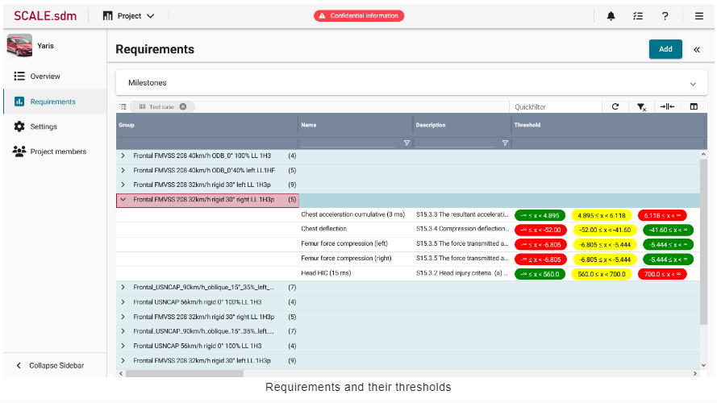
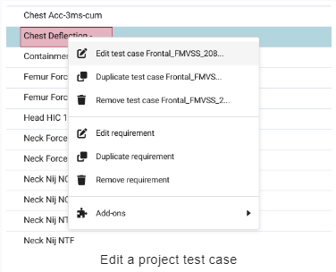
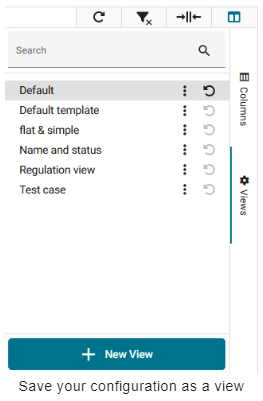

# SCALE.project

## Basic concepts

### Systems Engineering in the Automotive Industry

시스템 엔지니어링은 제품 개발, 특히 주문자 상표 부착 생산업체(OEM)에서 중추적인 역할을 담당합니다. 시스템 엔지니어링은 전체 수명 주기 동안 복잡한 시스템을 설계, 통합 및 관리하는 데 중점을 둔 총체적이고 학제적인 접근 방식입니다.

새로운 제품을 설계하든 단일 제품 구성 요소를 수정하든 시스템 엔지니어링은 다양한 요구 사항의 균형을 맞추고 여러 관점에서 프로젝트를 보기 위해 노력합니다. 고객이 원하고 기대하는 기능은 무엇인가요? 어떤 안전 및 규정 준수 표준을 충족해야 하는가? 생산은 언제 시작될 예정인가요?

### Test cases

안전 및 규정 준수 표준에 대해 자세히 살펴봅시다. 자동차를 설계하면서 충돌 안전성을 테스트하고 싶다고 가정해 보겠습니다. 구체적으로 시속 56km로 단단한 장벽에 충돌했을 때 자동차가 어떻게 작동하는지 알고 싶다고 가정해 보겠습니다. 테스트 케이스는 충돌 테스트를 설정하는 방법과 충돌 테스트가 수행되는 조건(예: 장벽, 속도, 온도 및 충격 각도)을 정의합니다.

충돌 테스트가 진행되는 동안 센서와 장치는 더미가 받는 손상 정도를 측정합니다. 예를 들어 충돌 시 운전자의 가슴이 얼마나 휘어지는지 또는 운전자의 대퇴골에 가해지는 힘의 양을 측정할 수 있습니다. 가슴 편향과 대퇴골 힘과 같은 각 측면을 요구 사항이라고 하며, 허용되는 값의 범위와 허용되지 않는 값의 범위가 있습니다.

### Requirements

요구 사항은 단독으로 존재하지 않습니다. 오히려 특정 테스트 사례와 관련하여 정의됩니다. 예를 들어 시속 56km/h 정면 충돌 테스트에서 가슴 편향값은 허용 범위 내에 있어야 합니다. 제품 개발의 일부는 향후 제품이 충족해야 하는 요구 사항을 정의하는 것입니다.

### Assessment

충돌 테스트 중에 각 요건이 측정되고 값을 받습니다. 예를 들어 충돌 테스트 더미의 가슴이 46mm 휘어진 경우 이 값이 요구 사항의 현재 상태로 저장됩니다.

그런 다음 현재 상태를 허용 가능한 값과 허용되지 않는 값의 범위와 비교하여 실제 값이 목표 값과 얼마나 다른지 확인할 수 있습니다. 프로젝트 관리자는 언제든지 테스트 케이스를 보고 얼마나 많은 요구 사항이 충족되었는지 확인할 수 있습니다.

## Initial configuration

:::{note}
관리자와 같이 포괄적인 권한을 가진 사람이 처음에 {class="intxt-image"}**Project**를 구성해야 합니다. 이 사람은 속성, 요구 사항 및 테스트 케이스와 같은 마스터 데이터를 만들고 수정할 수 있는 권한이 있어야 합니다. 이 초기 구성이 완료되면 관리자는 프로젝트 관리자 및 프로젝트 기여자를 위한 계정 등 추가 사용자 계정을 만들 수 있습니다.
:::

초기 구성은 예를 들어 다음과 같은 순서로 완료 할 수 있습니다.

- [Create MDM attributes](#create-mdm-attributes)
- [Create MDM requirements based on these attributes](#create-mdm-requirements-based-on-these-attributes)
- [Group the requirements into MDM test cases](#group-the-requirements-into-mdm-test-cases)
- [Create other use accounts and grant permissions](#create-other-user-accounts-and-grant-permissions)

### Create MDM attributes

1. **Configuration > MDM > Attributes**로 이동합니다.
2. 상단 오른쪽에 **New**를 클릭하면 새로운 window가 나타납니다.
3. 필요에 따라 설정을 구성합니다.
4. 를 클릭해서 설정을 저장합니다.

MDM attributes에 대한 자세한 지침과 각 설정에 대한 설명은 [여기](#mdm-attributes)에서 확인할 수 있습니다.

### Create MDM requirements based on these attributes

1. **Configuration > MDM > Requirements**로 이동합니다.
2. **New**를 클릭합니다.
3. 필요에 따라 설정을 구성합니다.
4. 를 클릭해서 설정을 저장합니다.

MDM requirements에 대한 자세한 지침과 각 설정에 대한 설명은 [여기](#mdm-requirements)에서 확인할 수 있습니다.

### Group the requirements into MDM test cases

1. **Configuration > MDM > Test cases**로 이동합니다.
2. **New**를 클릭합니다.
3. 테스트 케이스에 대한 정보를 추가하고 테스트 케이스에 포함해야 하는 requirements를 선택합니다.
4. 를 클릭해서 설정을 저장합니다.

MDM test cases 구성에 대한 자세한 지침과 각 설정에 대한 설명은 [여기](#mdm-test-cases)에서 확인할 수 있습니다.

### Create other user accounts and grant permissions

1. **Configuration > User Management > Users**로 이동합니다.
2. **New**를 클릭합니다.
3. 필요에 따라 설정을 구성합니다.
4. 를 클릭해서 설정을 저장합니다.

MDM user accounts 구성에 대한 자세한 지침과 각 설정에 대한 설명은 [여기](#user-management)에서 확인할 수 있습니다.

## Set up a project

:::{admonition} Project managers set up the project
:class: note
Project는 처음에 project 설정을 추가, 변경 및 삭제할 수 있는 권한이 있는 사용자(예: project 관리자)가 설정합니다. project가 설정되면 project 관리자는 project에 다른 멤버를 추가할 수 있습니다.
:::

예를 들어 다음과 같은 순서로 프로젝트를 설정할 수 있습니다.

- [Create a new project](#create-a-new-project)
- [Open an existing project](#open-an-existing-project)
- [Star favorite projects](#star-favorite-projects)
- [Edit a project's name or description](#edit-a-projects-name-or-description)
- [Manage project documents](#manage-project-documents)
- [Add project attributes](#add-project-attributes)

### Create a new project

1. {class="intxt-image"}**Project**를 열어 projects의 overview를 표시합니다.
2. 상단 오른쪽에 **New Project**를 클릭합니다.
3. 생성할 project의 이름(Name)과 설명란(description)을 작성합니다. 
4. Project 유형(type)을 드롭 다운 메뉴에서 선택합니다.
5. **Create Project**를 클릭합니다. project는 overview에 표시되고 다시 편집할 수 있습니다. 예를 들어 생성된 project에 이제 문서(documents), 속성(attributes), 마일스톤(milestones), 요구조건(requirements) 그리고 멤버들(members)을 추가할 수 있습니다.

### Open an existing project

1. {class="intxt-image"}**Project**를 열어 projects의 overview를 표시합니다.
2. 선택사항으로 오른쪽 상단 모서리의 **Filter by name** 필드에 project 이름을 입력하거나 다음 예정된 마일스톤을 기준으로 project를 정렬할 수 있습니다. 이러한 옵션을 사용하면 원하는 project를 빠르게 찾을 수 있습니다.
3. 목록에서 project의 이름을 클릭합니다. project가 열리고 왼쪽 사이드바에서 **Overview**가 자동으로 선택됩니다.

### Star favorite projects

1. Project를 즐겨찾기 기능처럼 선호하는 주 project를 설정 할 수 있습니다.
2. Project를 열어 즐겨찾기 할 project의 **Star** 마크를 클릭합니다. 
3. 즐겨찾기된 project는 상단 메뉴에서 Projects를 선택하면 나타나는 리스트 메뉴의 Starred Projects에 표시됩니다.
4. 다시 **Star** 마크를 클릭하면 즐겨찾기를 해제할 수 있습니다.

### Edit a project's name or description

1. Project를 열어 왼쪽 사이드바(sidebar)에서 **Settings**를 클릭합니다.
2. Project 이름, 유형, 설명 및 이미지를 편집합니다.
3. 를 클릭하여 변경된 사항을 저장합니다.

### Manage project documents

1. Project를 엽니다. **Overview**는 자동으로 왼쪽 사이드바에서 선택됩니다.
2. **Documents** 섹션(section)을 찾습니다. 이곳에서 project 관련 문서를 관리합니다. 문서의 이름과 파일 형식, 문서를 추가한 사용자의 이름이 표 형식의 개요(overview)에 표시됩니다.

### Add project attributes

프로젝트 속성(attribues)은 키-값 쌍(key-value pairs)을 사용하여 프로젝트 속성에 대한 기술적 설명을 가능하게 합니다. 이 정보를 통해 프로젝트를 분류하고 향후 관련 프로젝트 요구 사항을 파악할 수 있습니다.

1. 자신의 프로젝트를 엽니다.
2. 왼쪽 사이드바(sidebar)에서 **Attributes**를 클릭합니다.
3. **Edit**를 눌러 새 창을 띄웁니다.
4. {class="intxt-image"}를 눌러 새 라인을 추가합니다.
5. 왼쪽에 위치한 영역(field)에 속성(attribute)의 이름을 입력합니다. 해당 영역(field)는 자동완성 기능을 가지고 있습니다. 입력할 때 과거에 입력했던 항목들에서 예측해 표시해줍니다.
6. 오른쪽에 위치한 드롭-다운(drop-down) 리스트에서 하나 혹은 두개 이상의 값들을 선택합니다.
7. **Save**를 클릭하여 속성들을 업데이트 합니다.

:::{admonition} Configure MDM attributes in advance
:class: tip
MDM 속성들은 프로젝트에 추가하기 전에 **Configuration > MDM > Attributes에서 구성되어야 합니다. 이 초기 구성은 MDM 권한이 있는 사용자(ex. admin)가 수행합니다.
:::

### Milestones

#### Add project milestones

1. 자신의 프로젝트를 엽니다. 왼쪽 사이드바(sidebar)에서 **Overview**가 자동으로 선택됩니다.
2. **Milestones** 섹션을 찾아 {class="intxt-image"}를 클릭하여 새 창을 표시합니다.
3. (**A**)에 이름과 (**B**)에 설명(description)을 입력합니다. 
4. 하나의 단일 계획(plan)은 master(**C**)로 지정하여 가장 관련성이 높은 프로젝트 마일스톤이 포함되어 있음을 나타낼 수 있습니다. 마스터 계획은 시간 스케일(time scale)과 목록에서 가장 먼저 표시됩니다. 그리고 글꼴과 아이콘으로 강조 표시됩니다.
5. 일정에 마일스톤을 원하는 수만큼 추가합니다. 각 마일스톤에 이름, 날짜, 설명을 입력합니다.(**D**)
6. **Save** (**H**)를 클릭하여 마일스톤 계획을 업데이트 합니다.

#### View milestones in the overview

1. 자신의 프로젝트를 엽니다. **Overview**가 왼쪽 사이드바(sidebar)에서 자동으로 선택됩니다.
2. **Milesones** 섹션에서 모들 프로젝트 참가자들에 대한 프로젝트 일정의 개요를 확인할 수 있습니다.

- **A**: 시간 스케일(time scale)의 그래픽 표현
- **B**: 마일스톤에 마우스를 위치 시켰을 때 마일스톤에 대한 상세 정보가 표시됩니다.
- **C**: 현재 날짜가 표시되며 수식선과 연결됩니다.
- **D**: 네 가지 옵션이 표시됩니다.
    - {class="intxt-image"}: Download plot as a .png
    - {class="intxt-image"}: Zoom in
    - {class="intxt-image"}: Zoom out
    - {class="intxt-image"}: Reset axes
- **E**: List of schedules: 시간 척도(time scale)의 그래픽 표현 아래에는 마일스톤 계획별로 정렬된 일정이 표시되며, 이를 펼치거나 접을 수 있습니다. 마일스톤 이름, 설명 및 날짜는 표 형식의 개요로 표시됩니다.
- **F**: 존재하는 마일스톤 계획을 편집하기 위해 **Edit**을 클릭합니다.
- **G**: 새 마일스톤 계획을 추가하기 위해 {class="intxt-image"}를 클릭합니다.이 아이콘의 표시는 사용자의 권한에 맞추어 표시됩니다.

#### Add requirements and test cases to the project

Requirements는 테스트 케이스(test cases)를 통해 프로젝트에 추가됩니다. 즉, 프로젝트에 테스트 케이스를 추가하면 해당 테스트 케이스에 포함된 모든 요구 사항도 자동으로 추가됩니다.

1. 프로젝트를 엽니다.
2. 왼쪽 사이드바(sidebar)에서 **Requirements**를 클릭합니다.
3. 상단 오른쪽에 **Add**를 클릭합니다. **Add MDM Test Cases to Project 영역이 표시됩니다.
4. 적절한 테스트 케이스 ({class="intxt-image"})를 선택합니다.
5. {class="intxt-image"}를 클릭하면 테스트 케이스(test cases)에 포함된 모든 requirements가 자신의 프로젝트의 추가됩니다.

:::{admonition} Requirements and test cases can be edited to make them project-specific
:class: tip
특정 프로젝트 내의 requirements 및 테스트 케이스(test cases)를 project requirements 및 project test cases라고 합니다. 이는 MDM requirements 및 MDM test cases에서 파생됩니다. 이 과정에서 모든 속성, 임계값 등이 복사되며 필요한 경우 추가로 변경할 수 있습니다.
:::

### Add project members

1. 자신의 프로젝트를 엽니다.
2. 왼쪽 사이드바(sidebar)에서 **Project members를 클릭합니다. 여기에서 프로젝트 접근 권환이 있는 모든 사용자들을 확인할 수 있습니다.
3. 상단 오른쪽의 **+ADD**를 클릭하여 프로젝트에 새 멤버를 추가합니다. 새 창이 표시됩니다.
4. 상단에 프로젝트에 추가할 사용자를 선택합니다. 사용자 이름으로 사용자들을 찾을 수 있으며 이름 및 이메일 주소로 표시됩니다.
5. 하단에 사용자에 활당된 역할(role)을 선택합니다.
6. 향후에 사용자의 role을 변경할 필요가 있을 경우 **Project role** 열의 role을 더블 클릭하여 변경할 수 있습니다.

:::{admonition} Create user accounts and project roles in advance
:class: tip
- 사용자를 프로젝트에 추가하려면 먼저 **Configuration > User Management > Users**에서 사용자를 구성해야 합니다. 이 초기 구성은 해당 권한이 있는 사용자(예: admin)가 수행합니다.
- 프로젝트 role은 **Configuration > User Management > Project roles**에서 구성해야 사용자에게 할당할 수 있습니다. 이 초기 구성은 해당 권한이 있는 사용자(예: admin)가 수행합니다.
:::

## Tailor requirements to be project-specific

:::{admonition} Project managers nad/or contributors can tailor requirements
:class: note
프로젝트 관리자와 프로젝트 기여자 모두 프로젝트에 맞게 MDM requirements를 조정할 수 있습니다.

- **MDM requirements***: **Configuration** > **MDM** > **Requirements** 아래의 requirements를 MDM requirements라고 합니다. requirements template 또는 SCALE.sdm 애플리케이션에 대한 global requirements 데이터베이스라고 생각할 수 있습니다.

- **Project requirements**: 특정 프로젝트 내의 requirements를 project requirements이라고 합니다. 프로젝트 requirements은 MDM requirements에서 파생됩니다. 이 과정에서 원래 requirements의 속성, 임계값 등이 프로젝트별 requirements로 복사되며 필요한 경우 추가로 변경할 수 있습니다. 프로젝트에는 동일한 MDM requirements에서 파생된 여러 프로젝트 requirements이 있을 수 있습니다.
:::

예를 들어 다음과 같은 순서로 프로젝트를 맞춤 설정 할 수 있습니다.

- [View a requirement's details](#view-a-requirements-details)
- [Edit a test case to be project-specific](#edit-a-test-case-to-be-project-specific)
- [Edit the requirements to be project-specific](#edit-the-requirements-to-be-project-specific)

### Open an existing project

1. {class="intxt-image"}**Project**를 열어 프로젝트의 overview를 표시합니다.
2. 오른쪽 상단 모서리의 이름으로 필터링 필드에 프로젝트 이름을 입력하거나 다음 예정된 마일스톤을 기준으로 프로젝트를 정렬할 수 있습니다. 이러한 옵션을 사용하면 원하는 프로젝트를 빠르게 찾을 수 있습니다.
3. 목록에서 프로젝트 이름을 클릭합니다. 프로젝트가 열리고 왼쪽 사이드바에서 overview가 자동으로 선택됩니다.

### View a requirement's details

1. 프로젝트를 엽니다.
2. 왼쪽 사이드바(sidebar)에서 requirements를 클릭합니다. 여기에 프로젝트 requirements의 overview가 표시됩니다. 필요에 따라 이 개요에서 requirements을 필터링하거나 그룹화할 수 있습니다.
3. requirements를 클릭한 다음 requirements에 대한 자세한 정보를 보려면 requirement를 클릭합니다.

### Edit a test case to be project-specific

1. 프로젝트를 엽니다.
2. 왼쪽 사이드바에서 **Requirements**을 클릭합니다.
3. Overview에서 requirement를 마우스 오른쪽 버튼으로 클릭합니다. 컨텍스트 메뉴가 열립니다.
4. **Edit test case [Name of test case]**을 클릭합니다. 새 창이 열립니다.
5. 테스트 케이스가 프로젝트에 맞게 수정합니다.
6. {class="intxt-image"}를 클릭하여 설정을 저장합니다.

테스트 케이스 설정에 대한 자세한 지침은 MDM test cases 페이지에서 확인할 수 있습니다.

### Edit the requirements to be project-specific

한번에 하나의 requirement를 편집하거나 여러 requirements를 동시에 편집할 수 있습니다. 

#### Edit one requirement to be project-specific

1. 자신의 프로젝트를 엽니다.
2. 왼쪽 사이드바에서 **Requirements**을 클릭합니다.
3. Overview에서 requirements를 마우스 오른쪽 버튼으로 클릭합니다. 컨텍스트 메뉴가 열립니다.
4. **Edit requirement**을 클릭합니다. 새 창이 열립니다.
5. requirements를 프로젝트별로 수정합니다.
6. {class="intxt-image"}를 클릭하여 설정을 저장합니다.

requirement 설정에 대한 자세한 지침은 MDM requirements 페이지에서 확인할 수 있습니다.

#### Eidt multiple requirements at ones

1. 프로젝트를 엽니다.
2. 왼쪽 사이드바에서 **Requirements**을 클릭합니다.
3. 여러 requirements를 선택한 다음(Ctrl. + 클릭) 마우스 오른쪽 버튼을 클릭합니다. 컨텍스트 메뉴가 열립니다.
4. **Edit requirements**을 클릭합니다. 새 창이 열립니다. 여기에서 선택한 모든 requirements의 이름, 설명 및 평가 임계값(thresholds)을 동시에 편집할 수 있습니다.

##### Edit the names

1. 상단 박스를 선택합니다.
2. 첫번째 드롭-다운 리스트에서 **Change to apply**에서 옵션을 선택합니다.
    - **Replace**: requirement 이름 내에서 특정 단어 하나를 변경합니다.
    - **Replace all**: 전체 requirement 이름을 변경합니다.
    - **Add to beginning**: requirement 이름의 시작 부분에 특정 텍스트를 추가합니다.
    - **Add to end**: requirement 이름 끝에 특정 텍스트를 추가합니다.
3. 텍스트 영역(text filed)에 자신의 텍스트를 입력합니다.
4. {class="intxt-image"}를 클릭하여 설정을 저장합니다.

##### Edit the descriptions

1. 중간 박스를 선택합니다.
2. **Description**에 텍스트를 입력합니다.
3. {class="intxt-image"}를 클릭하여 설정을 저장합니다.

##### Edit the assessment thresholds

1. **Apply Changes to all Assessments** 영역을 펼칩니다.
2. 아래쪽 상자를 선택합니다.
3. 필요에 따라 평가 임계값(assessment thresholds)을 수정합니다. 자세한 지침은 MDM requirements 페이지에서 확인할 수 있습니다.
4. {class="intxt-image"}를 클릭하여 설정을 저장합니다.

## Configure the requirements grid

:::{admonition} Project managers and/or contributors can configure the grid
:class: note
프로젝트 관리자와 프로젝트 기여자 모두 열을 재정렬하고 필터를 적용하는 등 requirements grid를 구성할 수 있습니다.
:::

Requirements grid는 예를 들어 다음과 같은 순서로 구성할 수 있습니다.

- [Toggle and rearrange the columns](#toggle-and-rearrange-the-columns)
- [Group requirements by column headers](#group-requirements-by-column-headers)
- [Apply column filters](#apply-column-filters)
- [Change the sorting order](#change-the-sorting-order)
- [Save the configuration as a view](#save-your-configuration-as-a-view)
- [Share views with other users](#share-views-with-other-users)

### Basic concept

Grid의 각 줄은 하나의 requirement(**B**)을 나타내고, 각 열은 requirement(**A**)에 대한 하나의 정보를 나타냅니다. 때로는 일부 열만 표시하고 다른 열은 숨기는 것이 도움이 될 수 있습니다. 필요에 따라 grid를 사용자 지정할 수 있습니다.

Grid 구성을 완료한 후에는 구성(configuration)을 'View'라는 이름으로 저장하고 이 view를 다른 사용자와 공유할 수도 있습니다. 이렇게 하면 나중에 구성에 다시 액세스할 수 있습니다. 예시: 서로 다른 두 개의 views를 만들 수 있습니다. 각 view에는 특정 작업에 필요한 열만 포함됩니다. 작업을 수행할 때 적절한 view를 선택하기만 하면 됩니다.

:::{admonition} What does the view define?
:class: tip
View는 레이아웃(layout)의 다음 측면을 제어합니다.

- 표시될 열
- 열이 표시되는 순서
- 열을 그룹화할지에 대한 여부
- 필터 적용 여부
- 열 내용을 오름차준 또는 내림차순으로 표시할지 여부

Note: View는 열의 크기를 제어하지 않습니다.
:::

:::{admonition} What does the view define?
:class: tip
SCALE.sdm에는 여러가지 grid가 있습니다. 예를 들어, {class="intxt-image"}**Project**에는 requirements grid가 있고 **Configuration** > **MDM** > **Requirements** 아래에 grid가 있습니다. 각 grid는 개별적으로 구성해야 합니다. View는 모든 grid에 저장되지 않습니다. 
:::

### Toggle and rearrange the columns

1. 프로젝트를 엽니다.
2. **Requirements**를 클릭합니다.
3. grid의 오른쪽 사이드의 {class="intxt-image"}를 클릭하면 사이드바가 표시됩니다.
4. 표시할 열을 선택하여 체크 표시({class="intxt-image"})가 되도록 합니다.
5. Optional: 마우스 커서를 {class="intxt-image"}에 가져가면 커서가 {class="intxt-image"}로 바뀌며 드래그 하여 그리드에서 열의 순서를 바꿀 수 있습니다.

### Group requirements by column headers

1. 프로젝트를 엽니다.
2. **Requriements**를 클릭합니다.
3. 마우스 커서를 열의 헤더(header)에 위치시키면 커서가 {class="intxt-image"}로 바뀝니다.
4. 열의 헤더를 드래그 하여 그리드 상단의 **Drag hear to set row groups**로 드롭합니다. 데이터들은 해당 열에 의해 그룹화 되어 표시됩니다.
5. 필요에 따라 다른 열에 대해서도 같은 방법으로 그룹화 할 수 있습니다.

:::{admonition} Alternative to drag & drop
:class: tip
다음고 같이 열 헤더에 의한 그룹화를 진행 할 수 있습니다.

1. 프로젝트를 엽니다. 
2. **Requirements**를 클릭합니다.
3. 마우스 커서를 {class="intxt-image"} 위로 위치시키고 클릭하여 컨텍스트 메뉴를 표시합니다.
4. **Group by [column name]** 옵션을 선택합니다. Grid에서 데이터는 해당 열에 의해 그룹화 됩니다.
5. 필요에 따라 다른 열에 대해서도 같은 방법으로 그룹화 할 수 있습니다.
:::

### Apply column filters

1. 프로젝트를 엽니다.
2. **Requirements**를 클릭합니다.
3. 열 헤더(header) 바로 아래 줄에 텍스트를 입력합니다.
4. 선택 사항으로 추가 필터 옵션에 액세스하려면 {class="intxt-image"}를 클릭합니다.
5. 필요한 경우 같은 방법으로 다른 열에도 필터를 적용합니다.

### Change the sorting order

1. 프로젝트를 엽니다.
2. 왼쪽 사이드바에서 **Requirements**을 클릭합니다.
3. 오름차순으로 정렬하려면 열 헤더를 클릭합니다.
4. 내림차순으로 정렬하려면 두 번 클릭합니다.
5. 정렬을 제거하려면 세 번 클릭합니다.

### Sort multiple columns

여러 열을 기준으로 정렬할 수도 있습니다. 예를 들어, 먼저 대상 시장(target market)별로 requirements를 정렬할 수 있습니다. 그런 다음 여러 requirements가 동일한 시장에 적용되는 경우 알파벳 순서로 정렬할 수 있습니다.

1. 프로젝트를 엽니다.
2. 왼쪽 사이드바에서 requirements를 클릭합니다.
3. 열 헤더를 클릭하여 데이터를 정렬합니다. 예를 들어, 대상 시장별로 requirements를 정렬합니다.
4. Shift 키를 누른 상태에서 다른 열 머리글을 클릭하여 두 번째 수준별로 정렬합니다. 예를 들어 동일한 시장에 여러 requirements가 적용되는 경우 이름별로 알파벳순으로 정렬할 수 있습니다. 참고: 열 레이블 오른쪽에 표시되는 숫자는 정렬이 적용되는 순서를 나타냅니다. 이를 통해 여러 열에서 정렬 순서를 이해하는 데 도움이 됩니다.
5. 필요한 경우 Shift 키를 누른 상태에서 추가 열 헤더을 계속 클릭합니다.

### Save your configuration as a view

1. 프로젝트를 엽니다.
2. **Requirements**를 클릭합니다.
3. Grid 상단 오른족의 {class="intxt-image"}를 클릭하고 사이드 바를 표시합니다.
4. {class="intxt-image"} **Views**를 클릭합니다. 존재하는 모든 뷰(view)가 리스트로 표시됩니다.
5. {class="intxt-image"} **New View**를 클릭합니다.
6. 뷰(view)에 대한 이름을 입력하고 **Save**를 클릭합니다. 자신의 view가 리시트에 추가됩니다.

:::{admonition}
:class: tip
Views 목록에는 기본값(default)이라는 항목이 있습니다. 아직 사용자 지정 보기(views)를 구성하지 않은 경우 기본 보기(default views)가 사용됩니다. 글로벌 관리자만 기본 보기를 만들거나 수정할 수 있습니다. 일반 사용자는 이 보기를 편집할 수 없습니다.
:::

### Share views with other users

다른 사용자와 보기(views)를 공유할 수 있습니다. 예를 들어 관리자는 여러 개의 서로 다른 보기를 만들 수 있습니다. 각 보기에는 특정 작업을 수행하는 데 도움이 되는 열과 필터가 포함되어 있습니다. 그런 다음 관리자는 이러한 보기를 해당 작업을 담당하는 동료들과 공유할 수 있습니다.

1. 프로젝트를 엽니다.
2. 왼쪽 사이드바에서 **Requirements**을 클릭합니다.
3. Grid의 맨 오른쪽의 {class="intxt-image"} 클릭합니다. 사이드 바가 표시됩니다.
4.  **Views**를 클릭합니다. 여기에 모든 기존 뷰(views) 목록이 표시됩니다.
5. 보기에 대한 추가 옵션을 보려면 를 클릭합니다.
6.  **Share**를 클릭합니다. 팝업 창이 열립니다.
7. 드롭다운 목록에서 분야(discipline)를 선택합니다.
8.  **Confirm**을 클릭합니다. view가 해당 분야(discipline)의 모든 사용자와 공유됩니다.

## Report the current requirement status

## Master data management (MDM)
### MDM attributes
### MDM requirements
### MDM test cases
### User management