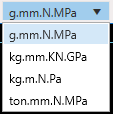
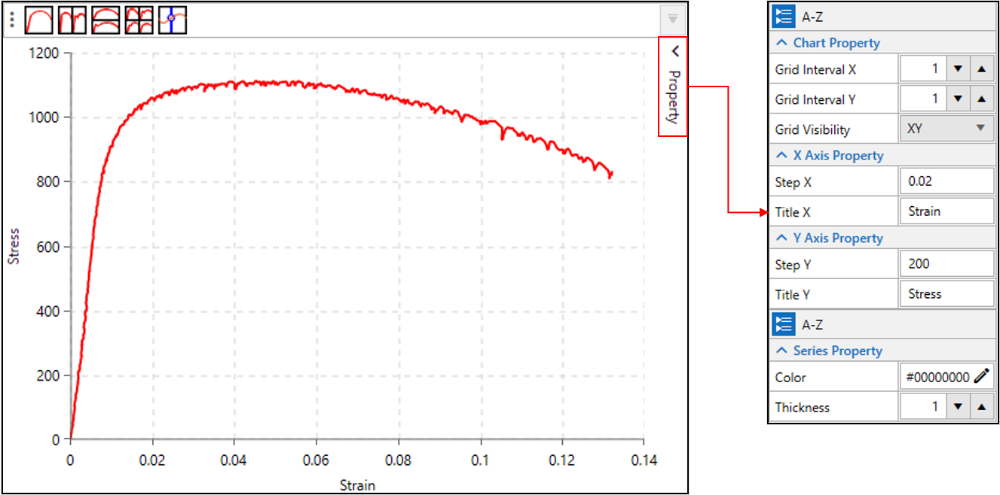
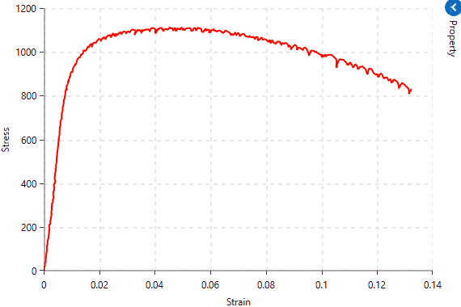

# Appendix

## 1. LS-Dyna 단위계
LS-Dyna는 기본적으로 데이터의 단위계를 명시하지 않고, 입력되는 데이터의 값으로 계산되기 때문에 LS-Dyna에서 사용가능한 단위 셋(set)에 맞추어 값을 입력해야 합니다. 아래 사진에서 LS-Dyna에서 사용되는 단위계 셋(set)을 확인하세요. 아래 사진의 테이블은 LAMP에서 Help 메뉴의 Units 아이콘을 통해서 확인할 수 있습니다.

## 2. 전역 단위 변환
LAMP에서는 기본적으로 입력되는 데이터의 단위는 g.mm.N.MPa 단위이기 때문에 사용자가 실제 사용되는 단위계로 표시하거나 출력할 수 있도록 단위를 변환할 수 있습니다. 단위를 변환하기 위해서는 LAMP 프로그램 제일 하단 우측에 있는 ComboBox에서 변환하고자 하는 단위를 선택함으로써 변환할 수 있습니다. 현재 사용가능한 단위변환 목록은 아래 사진과 같습니다.

사용가능한 단위계 목록에서 변환하고자 하는 단위계를 선택하면 UI에 입력된 값들이 선택된 단위계로 변환됩니다. 선택된 단위계는 [Application configuration](./comments.md#application-configuration-target) 요소로써 다시 변경하지 않는 한 설정이 유지 됩니다. 

## 3. Chart 기능
### Chart 요약
LAMP는 기본적으로 Chart UI가 중앙에 위치하고 있습니다. Chart UI에는 작업중에 생성되는 Curve 등의 라인 데이터가 표시되며 Chart 분할, 포인트 트랙킹, Chart 및 라인 속성 설정 등의 기능을 사용할 수 있습니다. 기본적으로 표시되는 Chart UI는 다음과 같습니다. 상단에는 Chart 분할 및 포인트를 트랙킹 할 수 있는 아이콘이 있습니다. 우측편에는 Chart 및 라인 속성을 설정할 수 있는 메뉴가 숨어 있습니다. 우측의 Property를 클릭하시면 별도의 입력창이 표시됩니다. 속성 입력란의 Series는 특정 하나의 Series를 선택한 후 설정합니다. 여기서 Series는 Chart에 그려진 하나의 데이터 라인을 의미합니다.

:::{list-table} Chart 속성 설명
:widths 10 100
:header-rows: 1

*   - 속성
    - 설명
*   - Grid Interval X
    - 가로축의 그리드(회색 점선)의 간격을 조정합니다.
*   - Grid Interval Y
    - 세로축의 그리드(회색 점선)의 간격을 조정합니다.
*   - Grid Visibility
    - 그리드(회색 점선)을 나타낼 축을 설정합니다.(None, X, Y, XY)
*   - Step X, Step Y
    - X 및 Y축에 표시되는 값의 간격을 조정합니다. 
*   - Title X, Title Y
    - X 및 Y축에 표시되는 축 이름을 설정합니다.
:::

:::{list-table} Series 속성 설명
:widths 10 100
:header-rows: 1

*   - 속성
    - 설명
*   - Color
    - 선택된 Series의 색상을 설정합니다.
*   - Thickness
    - 선택된 Series의 두께를 설정합니다.
:::

### Pan, Zoom in, Zoom out
Chart UI에서 마우스를 이용하여 확대 및 축소 그리고 이동을 할 수 있습니다. 확대, 축소는 간단하게 마우스의 휠을 움직여 할 수 있습니다. 이동은 마우스의 우측 버튼을 클릭한 채 마우스를 움직입니다. 원래 상태로 돌아오기 위해서는 ESC 버튼을 누릅니다.  

